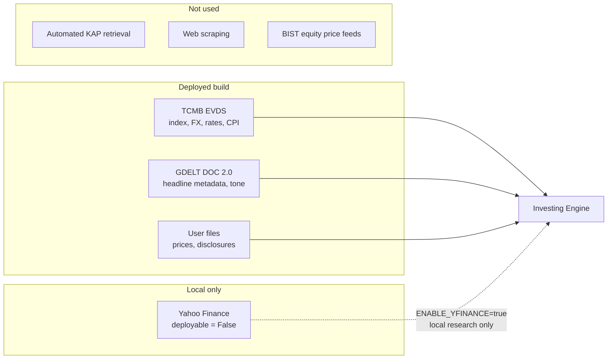
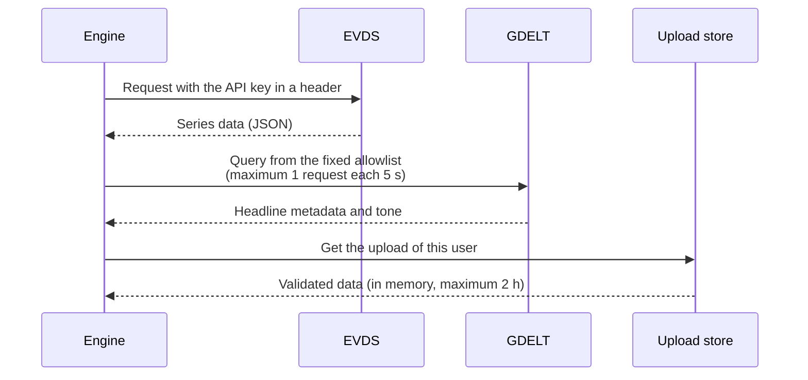
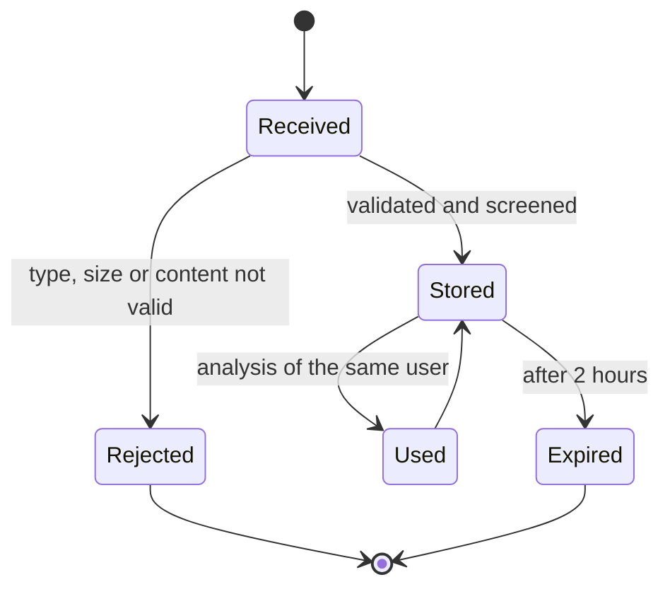
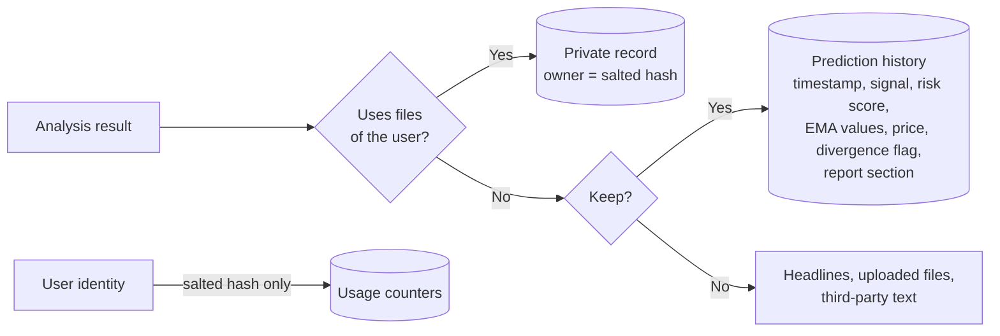

# Data Sources and Licensing

> **Note:** This document uses ASD-STE100 Simplified Technical English.

Investing Engine uses only data sources whose terms permit use in a hosted
application with many users. The code declares each source with its terms,
its attribution text and a `deployable` flag. Refer to
[`providers/base.py`](src/investing_engine/providers/base.py). Each analysis
returns the attribution of all sources that it used. The web app shows this
attribution.

---

## Sources in the deployed build

| Source | Use | Terms | Attribution that the app shows |
|---|---|---|---|
| [TCMB EVDS](https://evds3.tcmb.gov.tr), Central Bank of the Republic of Türkiye | BIST 100 index closes, USD/TRY, EUR/TRY, CBRT funding rate, CPI | Third parties can use and republish the data if they cite the source. A free API key is necessary. | *Source: Central Bank of the Republic of Türkiye (TCMB), EVDS.* |
| [The GDELT Project](https://www.gdeltproject.org/), DOC 2.0 API | Headline metadata (title, outlet, URL, time) and average tone | Use without limits, also for commercial use and redistribution. A citation of and a link to the GDELT Project are necessary. | *News metadata: The GDELT Project (https://www.gdeltproject.org/).* |
| Files from the user | Daily OHLCV data for equities | The user gives the file from a licensed source, for example a brokerage export. | *Price data supplied by the user.* |
| Documents from the user | Company disclosures, for example KAP filings that the user downloaded | The user gives the document. The engine reads it in memory (text layer or OCR) for the analyses of that user only. | *Disclosure document supplied by the user.* |

### How the engine uses each source

- **EVDS.** The client sends the API key in a request header, not in the URL.
  The client is typed, has timeouts and does not follow redirects. The script
  [`scripts/verify_evds_series.py`](scripts/verify_evds_series.py) makes sure
  that each series code gives live data.
- **GDELT.** The engine uses only headline metadata and the tone value of
  GDELT. It never gets the text of an article. The engine makes each query
  from a fixed instrument allowlist, never from user input. It sends a
  maximum of one request each five seconds, as GDELT recommends.
- **User uploads.** The engine validates each upload:
  - Price files: size, number of rows, encoding and necessary columns.
  - Documents: also the first bytes of the file, the number of pages and the
    size of decoded images.

  The engine keeps uploads in memory for a maximum of two hours. Only the user
  who uploaded a file can use it. The engine does not write uploads to disk.
  It does not keep models that it trained on uploaded data. It screens the
  text of documents for prompt injection before a model sees it. Traces keep
  only a cut version of this text.

### Upload lifecycle

---

## Local-only source

| Source | Status |
|---|---|
| Yahoo Finance through `yfinance` | The terms of Yahoo permit personal use only. They do not permit redistribution. The provider has `deployable=False`. It is off if `ENABLE_YFINANCE` is not `true`. Only the optional `local` extra installs it. The local research script `scripts/backtest.py` uses it. |

---

## Sources that the engine does not use

| Source | Reason |
|---|---|
| Automated KAP (Public Disclosure Platform) retrieval | Production use of the KAP data service needs a data distribution agreement with Borsa İstanbul. Thus the engine reads only disclosures that the user uploads. |
| Web scraping of news or market data sites | The content of publishers has copyright. The terms of most sites do not permit automated collection. |
| Real-time or delayed BIST equity prices | Borsa İstanbul licenses this data. Redistribution needs a vendor agreement. |

---

## Stored data

The prediction history database keeps only the output of the engine for each
analysis:

- The timestamp.
- The signal.
- The news risk score.
- The EMA values.
- The price at the time of the analysis.
- A divergence flag.
- The report section.

The database does not keep headlines, uploaded files or third-party text.

The history has two types of record:

- **Shared records.** Analyses that use only public data (for example XU100).
  All users can see these records.
- **Private records.** Analyses that use the price file or the document of a
  user. Only that user can see these records. The database keeps a salted hash
  of the identity of the user, not the identity. The API never returns this
  hash.

The usage counters also keep only a salted hash of the identity of each user.

---

Nothing that this project makes is investment advice.
