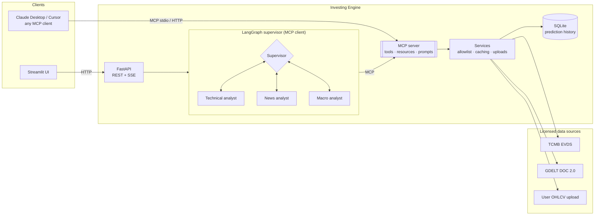
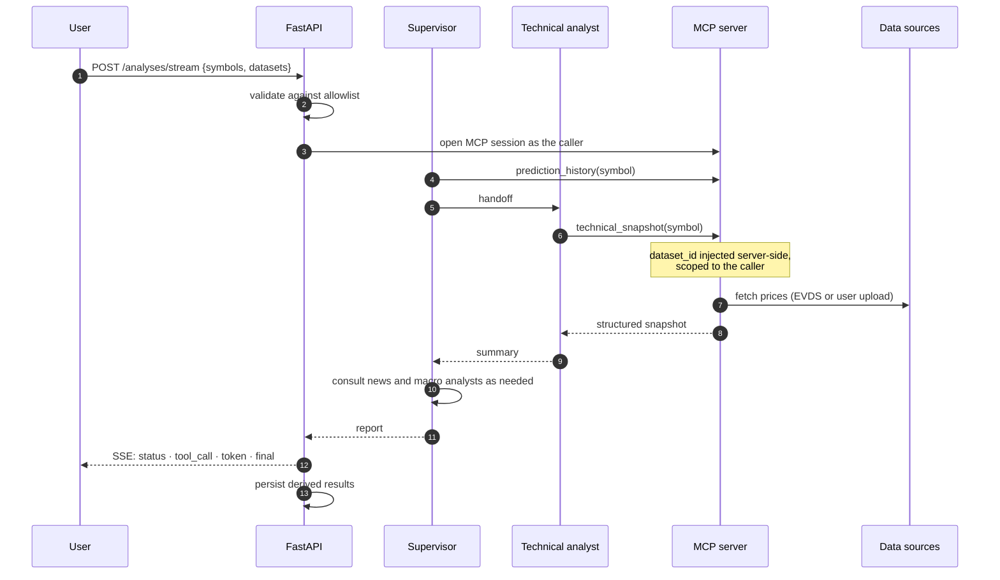

# Investing Engine

[](https://github.com/MuhammetAliVarlik/AgenticInvestingEngine/actions/workflows/tests.yml)


**An MCP-native, multi-agent research engine for Borsa İstanbul.** A LangGraph
supervisor coordinates specialist agents for technical analysis, headline
risk and the Turkish macro backdrop. Every capability is published as a
[Model Context Protocol](https://modelcontextprotocol.io) server, so the same
tools power the engine's own agents, Claude Desktop, Cursor or any other MCP
client. Built on licensed, attributable data sources only, and runs on a
local model (Ollama) or a hosted one (Groq) with a single setting.

---

## Contents

- [Highlights](#highlights)
- [Architecture](#architecture)
- [Quick start](#quick-start)
- [Use it from Claude Desktop](#use-it-from-claude-desktop)
- [MCP reference](#mcp-reference)
- [HTTP API](#http-api)
- [Configuration](#configuration)
- [Security model](#security-model)
- [Data sources](#data-sources)
- [Evaluation](#evaluation)
- [Development](#development)
- [Project layout](#project-layout)
- [Roadmap](#roadmap)

---

## Highlights

- **MCP server and client in one system.** Tools, resources and prompts are
  exposed over MCP (stdio and Streamable HTTP). The engine's own agents
  discover those tools over the protocol through `langchain-mcp-adapters`,
  exactly as an external client would.
- **Genuine supervisor routing.** The supervisor's own LLM turns decide which
  specialist to consult and when to write the report. It can skip, reorder
  or revisit specialists. Each specialist only receives the tools it needs.
- **Grounded output.** Indicator values, risk scores and source attribution
  come back as structured data alongside the report, and the UI renders from
  that data rather than from model prose.
- **Licensed data by design.** TCMB EVDS for index levels and macro series,
  GDELT for headline metadata, and the user's own price exports for
  individual equities. Each source carries its terms and attribution in code.
- **Security as a first-class concern.** Allowlisted symbols, read-only
  tools, owner-scoped uploads, identifiers kept out of the model's reach,
  safe error surfaces, a non-root, read-only container, and loopback-only
  network defaults. See the [Security model](#security-model).
- **Memory across analyses.** Every analysis is stored, and the supervisor
  reviews its own previous views on an instrument before writing a new one.
- **Live reasoning stream.** Server-sent events expose each routing decision,
  tool call and token as it happens.
- **Local or hosted LLM.** `LLM_PROVIDER=ollama` keeps everything on your
  machine; `LLM_PROVIDER=groq` runs on Groq's free tier with no GPU.

---

## Architecture



### One analysis, end to end



---

## Quick start

**Requirements:** Python 3.10+, and either a [Groq API key](https://console.groq.com)
(free) or [Ollama](https://ollama.com). A free
[EVDS API key](https://evds3.tcmb.gov.tr) enables index prices and macro data.

```bash
git clone https://github.com/MuhammetAliVarlik/AgenticInvestingEngine.git
cd AgenticInvestingEngine
python -m venv .venv && source .venv/bin/activate
pip install -e ".[dev]"
cp .env.example .env        # add GROQ_API_KEY and EVDS_API_KEY, set LLM_PROVIDER
```

Run the API and the UI:

```bash
uvicorn investing_engine.api.main:app --port 8080
API_BASE_URL=http://localhost:8080 streamlit run ui/streamlit_app.py
```

Or with Docker:

```bash
docker compose up --build                     # hosted LLM (Groq)
docker compose --profile ollama up --build    # local LLM (Ollama, NVIDIA GPU)
```

| Service | URL |
|---|---|
| Streamlit UI | http://localhost:8501 |
| API + OpenAPI docs | http://localhost:8080/docs |

---

## Use it from Claude Desktop

Add the server to `claude_desktop_config.json`:

```json
{
  "mcpServers": {
    "investing-engine": {
      "command": "/absolute/path/to/.venv/bin/investing-engine-mcp",
      "env": { "EVDS_API_KEY": "your-key" }
    }
  }
}
```

Then ask, for example: *"Use the investment_report prompt for XU100."*
To inspect the server interactively:

```bash
npx @modelcontextprotocol/inspector .venv/bin/investing-engine-mcp
```

---

## MCP reference

### Tools

| Tool | Description | Annotations |
|---|---|---|
| `list_instruments` | Supported instruments and whether public prices exist | read-only |
| `technical_snapshot(symbol, dataset_id?)` | EMA34/89, MACD, Bollinger %B, RSI and RSI-Fibonacci levels; ATR, ADX, Stochastic and OBV when OHLCV is available; RandomForest next-period RSI forecast mapped to a signal | read-only |
| `upload_price_csv(symbol, csv_text)` | Register the caller's own daily OHLCV export | write (caller-scoped) |
| `macro_snapshot` | USD/TRY, EUR/TRY, CBRT funding rate and CPI inflation with recent changes | read-only |
| `news_headlines(symbol, days?, limit?)` | Recent headline metadata and GDELT average tone | read-only |
| `prediction_history(symbol, limit?)` | The engine's previous analyses of an instrument | read-only |

### Resources and prompts

| URI / name | Content |
|---|---|
| `instruments://universe` | All supported instruments |
| `sources://attribution` | Active data sources, their terms and attribution |
| `history://{symbol}` | Full analysis timeline for an instrument |
| prompt `investment_report(symbol)` | Guided, multi-source research workflow |

### Transports

| Transport | Command | Notes |
|---|---|---|
| stdio | `investing-engine-mcp` | Default; used by desktop clients |
| Streamable HTTP | `investing-engine-mcp --transport streamable-http` | Loopback only, DNS-rebinding protection enabled |

---

## HTTP API

| Method | Path | Purpose |
|---|---|---|
| `GET` | `/healthz` | Liveness and version |
| `GET` | `/instruments` | Supported instruments |
| `GET` | `/sources` | Active data sources and attribution |
| `POST` | `/datasets` | Upload an OHLCV CSV (multipart: `symbol`, `file`) and get a `dataset_id` |
| `GET` | `/technical/{symbol}` | Indicators and forecast only, no LLM |
| `POST` | `/analyses` | Full multi-agent analysis |
| `POST` | `/analyses/stream` | The same, as server-sent events |
| `GET` | `/history/{symbol}` | Stored analysis timeline |

```bash
curl -s localhost:8080/analyses -H 'content-type: application/json' \
     -d '{"symbols": ["XU100"]}' | jq '.technical.XU100.signal, .risk'
```

`/analyses` returns the report together with the structured data it is based on:

```json
{
  "report": "## XU100 - BIST 100 Index\n**Technical view:** neutral - ...",
  "technical": { "XU100": { "signal": "neutral", "ema34": 10512.4, "rsi": 54.2, "...": "..." } },
  "risk": { "XU100": 4.0 },
  "sources": [{ "name": "TCMB EVDS", "attribution": "Source: Central Bank of the Republic of Türkiye (TCMB), EVDS." }],
  "timings": { "total_seconds": 21.4, "gathering_seconds": 15.9 },
  "cached": false
}
```

Stream events: `status`, `tool_call`, `tool_result`, `token`, `error`, and a
terminal `final` event with the same structure as above.

---

## Configuration

All settings are environment variables (or `.env`); see [`.env.example`](.env.example).

| Variable | Default | Purpose |
|---|---|---|
| `LLM_PROVIDER` | `ollama` | `ollama` or `groq` |
| `GROQ_API_KEY` / `GROQ_MODEL` | – / `llama-3.3-70b-versatile` | Hosted inference |
| `OLLAMA_BASE_URL` / `OLLAMA_MODEL` | `http://localhost:11434` / `llama3.1:latest` | Local inference |
| `EVDS_API_KEY` | – | Index prices and macro data |
| `ENABLE_YFINANCE` | `false` | Local-only Yahoo Finance provider |
| `MAX_SYMBOLS_PER_REQUEST` | `3` | Upper bound on work per request |
| `CACHE_TTL_SECONDS` | `600` | Identical-request cache window |
| `DB_PATH` / `MODEL_DIR` | `data/predictions.db` / `models` | Persistence |

---

## Security model

| Layer | Control |
|---|---|
| Input | Every symbol is validated against an explicit allowlist before reaching a provider, prompt or tool; requests are capped in size and symbol count; uploads are checked for size, rows, encoding and required columns. |
| Tools | All analysis tools are read-only; none can fetch arbitrary URLs or write files. A prompt injection can at worst distort a report, not exfiltrate data or take actions. |
| Model boundary | Upload identifiers never reach the model: they are removed from the tool schema the LLM sees and injected server-side for the authenticated caller. Prompts mark third-party text as untrusted data. |
| Isolation | Uploads live in memory, expire after two hours and are bound to their owner; a guessed id returns "not found". Models trained on user data are never persisted. |
| Errors | Tools and endpoints return safe, user-facing messages; internals are logged server-side only. |
| Secrets | Settings use `SecretStr`, so keys never appear in logs or reprs; the EVDS key is sent in a header, not the URL; `.env` is git-ignored. |
| Network | Published ports bind to `127.0.0.1`; Ollama publishes no port; the HTTP MCP transport is loopback-only with DNS-rebinding protection. |
| Runtime | Multi-stage image, non-root user, read-only root filesystem, all capabilities dropped, `no-new-privileges`. |
| Supply chain | Pinned dependencies and `pip-audit` in CI. |

---

## Data sources

| Source | Used for | Terms |
|---|---|---|
| TCMB EVDS | BIST 100 closes, FX, funding rate, CPI | Free use and republication with attribution |
| GDELT Project | Headline metadata and tone | Unrestricted use with citation |
| Your own export | Equity OHLCV | Your licensed copy, processed in memory |

Details, including sources deliberately excluded, are in
[DATA_SOURCES.md](DATA_SOURCES.md).

---

## Evaluation

### Test suite

100+ tests run in about a minute, with no network, GPU or LLM required. A
scripted chat model drives the real LangGraph supervisor and the real MCP
server end to end, so routing, handoffs, tool discovery, identity
propagation and streaming are all exercised. Coverage is above 90%.

### Signal backtest

[`scripts/backtest.py`](scripts/backtest.py) scores the RSI mean-reversion
thresholds on two years of daily history for five liquid BIST names, checking
the direction of the close five trading days after each signal (run
2026-10-01):

| Signal | Signals | Hit rate |
|---|---|---|
| Bullish (RSI < 30) | 39 | 87.2% |
| Bearish (RSI > 70) | 220 | 45.0% |

The bullish side is strongly directional. Overbought readings on these names
tend to mark momentum continuation rather than reversal, which is why the
supervisor weighs the signal against trend and news rather than treating it
as a standalone call.

---

## Development

```bash
pip install -e ".[dev]"
ruff check src tests scripts ui && ruff format --check src tests scripts ui
mypy                      # strict
pytest --cov
```

CI runs linting, formatting, strict type-checking, the test suite with
coverage and a dependency audit on every push and pull request.

---

## Project layout

```
src/investing_engine/
├── agents/          # LangGraph supervisor, prompts, MCP client session, LLM factory
├── analysis/        # Indicator engineering and the RSI forecaster
├── api/             # FastAPI application
├── mcp_server/      # MCP tools, resources, prompts and CLI entry point
├── providers/       # EVDS, GDELT, CSV upload, local-only Yahoo
├── config.py        # Typed settings
├── history.py       # Prediction history (SQLite)
├── services.py      # Data-licensing policy, caching, uploads
├── universe.py      # Instrument allowlist
└── uploads.py       # Owner-scoped, expiring upload store
tests/               # Unit and end-to-end tests
ui/                  # Streamlit front end
scripts/             # Backtest, benchmark, EVDS series verification
```

---

## Roadmap

- Disclosure analyst over user-uploaded KAP documents, with OCR for scanned filings
- Layered guardrails: prompt-injection detection, structured report validation and numeric grounding checks, with a red-team evaluation suite
- OpenTelemetry tracing with Langfuse, token budgets and capacity planning
- Downloadable PDF reports with charts
- Authenticated hosted demo (OAuth, CSRF protection, per-user quotas)

---

## License

[MIT](LICENSE). Outputs are for research and education and are not investment advice.
