# Investing Engine

[](https://github.com/MuhammetAliVarlik/AgenticInvestingEngine/actions/workflows/tests.yml)
[](https://github.com/MuhammetAliVarlik/AgenticInvestingEngine/actions/workflows/security.yml)


**Investing Engine is a multi-agent research system for Borsa İstanbul.**
A supervisor agent controls four specialist agents. Each specialist examines
one area: price trends, news risk, the Turkish macro economy or company
disclosures. The supervisor then writes one report. The system examines each
number in the report against the source data.

All tools of the engine are available through the
[Model Context Protocol](https://modelcontextprotocol.io) (MCP). The agents
of the engine use these tools through MCP. Claude Desktop, Cursor and other
MCP clients can use the same tools.

> **Note:** This document uses ASD-STE100 Simplified Technical English.

---

## Contents

- [Highlights](#highlights)
- [Architecture](#architecture)
- [How an analysis operates](#how-an-analysis-operates)
- [Web application](#web-application)
- [Quick start](#quick-start)
- [Use the engine from Claude Desktop](#use-the-engine-from-claude-desktop)
- [MCP reference](#mcp-reference)
- [HTTP API](#http-api)
- [Guardrails](#guardrails)
- [Observability](#observability)
- [Security model](#security-model)
- [Data sources](#data-sources)
- [Get your own data](#get-your-own-data)
- [Evaluation](#evaluation)
- [Deployment](#deployment)
- [Configuration](#configuration)
- [Development](#development)
- [Project layout](#project-layout)
- [Roadmap](#roadmap)

---

## Highlights

| Area | Function |
|---|---|
| **MCP server and client** | The server has eight tools, three resources and one prompt. It operates over stdio and Streamable HTTP. The agents of the engine find their tools through MCP, as an external client does. |
| **Supervisor routing** | The supervisor model decides which specialist to use and when to write the report. Each specialist gets only the tools that it must have. |
| **Document intelligence** | The engine reads PDF and image disclosures. For scanned pages, it uses Tesseract OCR in Turkish and English. A filter step makes noisy scans clear before OCR. |
| **Guardrails** | The engine finds prompt injection in all third-party text. It marks untrusted text, compares each number in the report with tool data and adds a disclaimer. |
| **Observability** | Langfuse traces record each agent step, each tool call and the token usage. JSON logs have a request ID. |
| **Cost control** | Each user has a daily limit for analyses and tokens. A circuit breaker stops calls after a provider rate limit. |
| **Reports** | The report is written for readers with no market knowledge: short sentences, each term explained once, and the meaning of each figure. You can download each analysis as a PDF with charts, indicator tables, risk history, quality results and source attribution. |
| **Web application** | A React and TypeScript application shows each step of the process. A gateway signs the user in and keeps the API token on the server. |
| **Access control** | Anonymous access codes (signed, time-limited, quota-bound, one device) or platform sign-in with an allowlist. An internal API with a token, rate limits, owner alerts by e-mail and a production configuration that stops if a setting is not safe. |
| **Privacy by design** | The public mode collects no personal data: no accounts, no IP addresses in logs, no document uploads and no content in traces. |
| **Licensed data** | The engine uses only TCMB EVDS, GDELT and files from the user. Each source has its terms and attribution in the code. |
| **Deployment-ready** | Infrastructure as code for Azure Container Apps (primary) and Hugging Face Spaces (fallback), with manual GitHub Actions workflows. Both targets have no cost. |

---

## Architecture

The diagram shows the main parts of the system and how they connect.

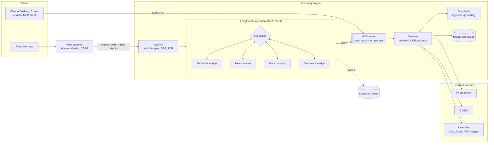

The table gives the function of each part.

| Part | Function |
|---|---|
| Web gateway | Serves the web app. Signs the user in. Sends approved calls to the API. |
| FastAPI | Examines the token and the user. Applies budgets. Streams events. Makes PDF reports. |
| Supervisor | Plans the analysis. Sends work to the specialists. Writes the report. |
| Specialists | Each specialist uses its own tools and gives a short result to the supervisor. |
| MCP server | Gives tools, resources and prompts to the agents and to external clients. |
| Services | Apply the data policy, read documents and keep uploads for each user. |
| Guardrails | Remove injected instructions and examine the numbers in the report. |

---

## How an analysis operates

### Agent routing

The supervisor uses the specialists in an order that it selects. It can skip
a specialist when the request does not need it.

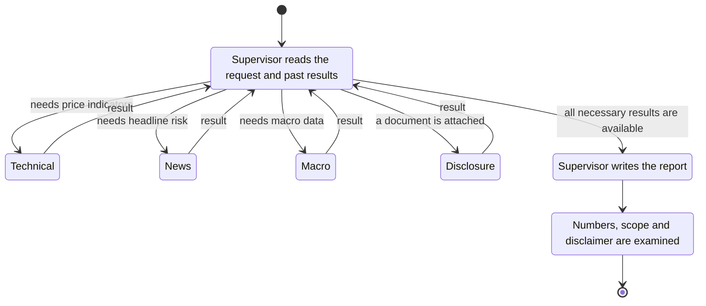

### One analysis from start to end

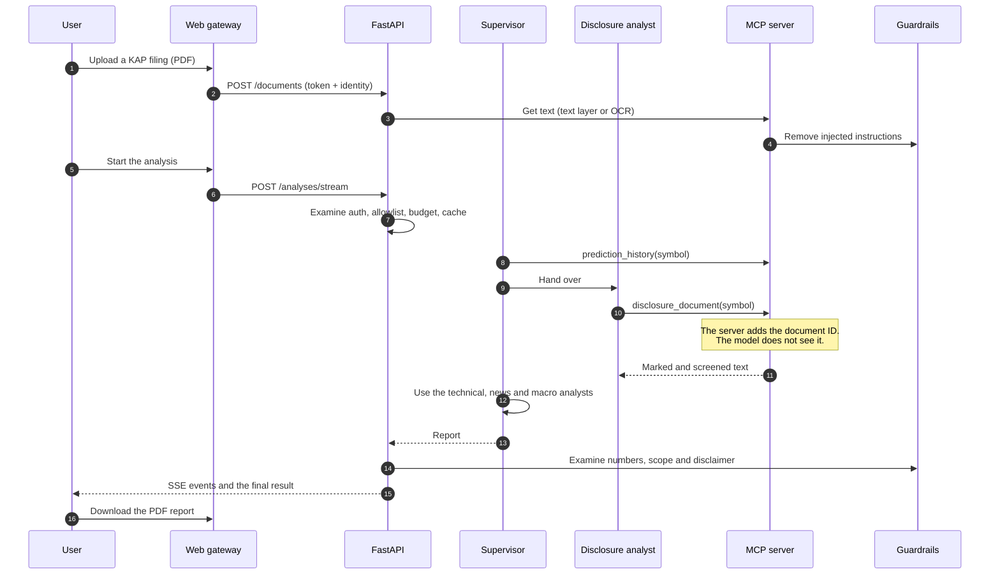

### Pipeline stages

The web app shows these stages while an analysis runs.

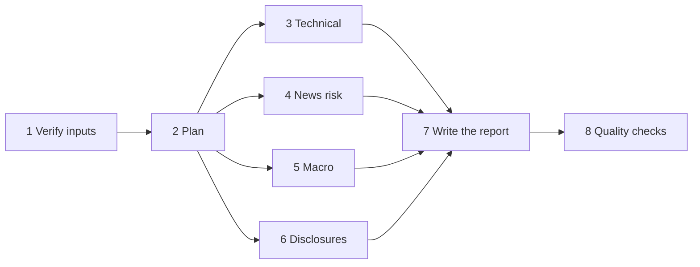

---

## Web application

The web app is one page, built with React, TypeScript and Tailwind CSS. It
shows the process in four numbered steps. Each step shows its status:
*Locked*, *Active* or *Complete*. The app supports light and dark mode and
phone screens.

If the deployment uses access codes, the app first asks for a code. A
**Privacy** link on each screen gives the privacy notice.

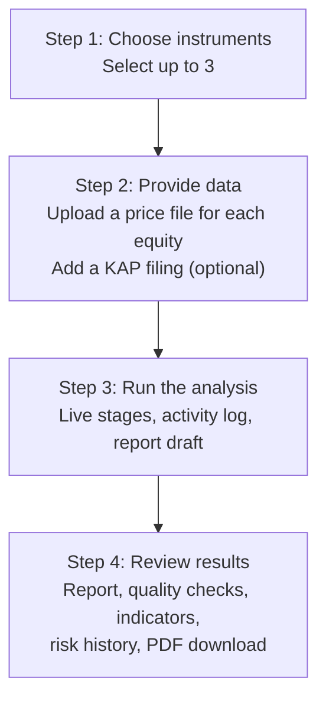

| Step | What you do | What the app shows |
|---|---|---|
| 1. Choose instruments | Search and select up to three instruments. | A label shows if an instrument needs a price file. |
| 2. Provide data | Upload a price file for each equity. Add a disclosure if necessary (not in access-code mode). | The app validates each file immediately. It shows the number of trading days and the date range. |
| 3. Run the analysis | Push **Start analysis**. You can cancel the analysis. | Each stage shows *Waiting*, *Running*, *Done* or *Not needed*. An activity log shows each tool call. |
| 4. Review results | Read the report. Open the tab of each instrument. | Quality values, indicators, a news-risk meter, a risk history chart (also as a table) and a PDF download. If a value is missing, the app shows "—", never an estimate. |

### Gateway request flow

The browser sends all calls to the gateway. The gateway adds the internal
token. The browser never gets the token.

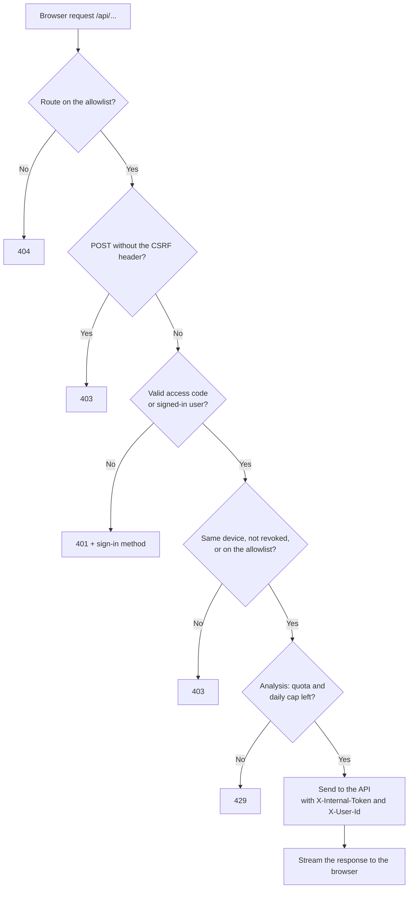

---

## Quick start

### Prerequisites

- Python 3.10 or later.
- Node.js 20 or later.
- Tesseract OCR (`tesseract-ocr` and `tesseract-ocr-tur`).
- A [Groq API key](https://console.groq.com) (free) or a local [Ollama](https://ollama.com) installation.
- An [EVDS API key](https://evds3.tcmb.gov.tr) (free). The engine uses EVDS for index prices and macro data.

### Install the engine

1. Clone the repository:

   ```bash
   git clone https://github.com/MuhammetAliVarlik/AgenticInvestingEngine.git
   cd AgenticInvestingEngine
   ```

2. Make a virtual environment and install the packages:

   ```bash
   python -m venv .venv && source .venv/bin/activate
   pip install -e ".[dev,observability]" -r ui/requirements.txt
   ```

3. Copy the configuration file:

   ```bash
   cp .env.example .env
   ```

4. In `.env`, set `LLM_PROVIDER`, `GROQ_API_KEY` and `EVDS_API_KEY`.
5. Make sure that the EVDS series codes give data (optional):

   ```bash
   python scripts/verify_evds_series.py
   ```

### Start the engine with Docker (recommended)

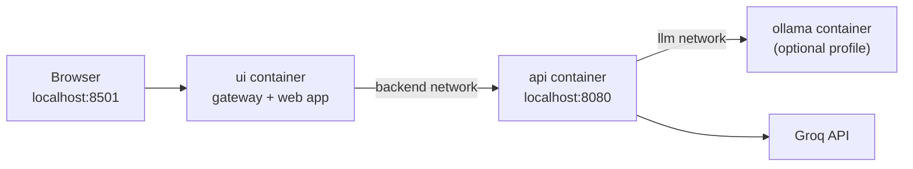

1. Start the containers:

   ```bash
   docker compose up --build                     # hosted model (Groq)
   docker compose --profile ollama up --build    # local model (Ollama, NVIDIA GPU)
   ```

2. Open the web app at http://localhost:8501.

| Service | URL |
|---|---|
| Web app | http://localhost:8501 |
| API and OpenAPI documentation | http://localhost:8080/docs |

### Start the engine without Docker

1. Start the API:

   ```bash
   uvicorn investing_engine.api.main:app --port 8080
   ```

2. Build the web app:

   ```bash
   cd ui && npm ci && npm run build
   ```

3. Start the gateway in the `ui` directory:

   ```bash
   API_BASE_URL=http://localhost:8080 uvicorn gateway.app:create_app --factory --port 8501
   ```

4. For front-end work, also run `npm run dev` in `ui`. Vite serves the app at
   http://localhost:5173 and sends API calls to the gateway.
5. To look at the interface without a backend, run `VITE_MOCK=1 npm run dev`.
   The app then shows sample data and a **Sample data** label. Production
   builds never contain the sample data.

---

## Use the engine from Claude Desktop

1. Add this entry to the Claude Desktop configuration:

   ```json
   {
     "mcpServers": {
       "investing-engine": {
         "command": "/absolute/path/to/.venv/bin/investing-engine-mcp",
         "env": { "EVDS_API_KEY": "your-key" }
       }
     }
   }
   ```

2. Restart Claude Desktop.
3. Write a request, for example: *"Use the investment_report prompt for XU100."*

To examine the server with an interactive tool, use the MCP Inspector:

```bash
npx @modelcontextprotocol/inspector .venv/bin/investing-engine-mcp
```

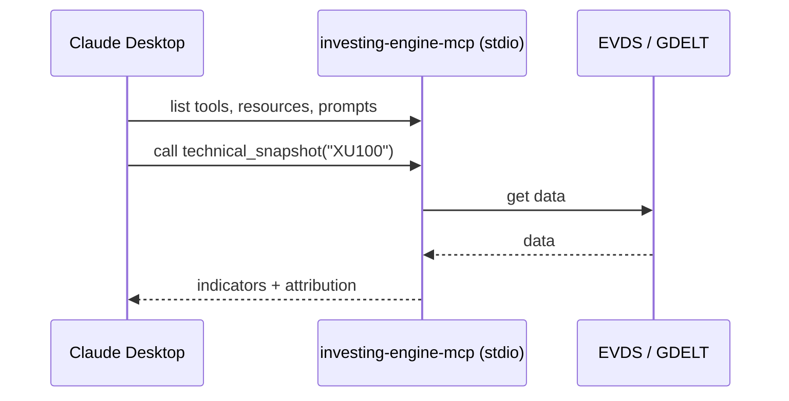

---

## MCP reference

### Tools

| Tool | Function | Type |
|---|---|---|
| `list_instruments` | Gives the supported instruments. Shows if public prices are available. | Read-only |
| `technical_snapshot(symbol, dataset_id?)` | Gives EMA 34/89, MACD, Bollinger %B, RSI and RSI Fibonacci levels. With OHLCV data, also ATR, ADX, Stochastic and OBV. A RandomForest model forecasts the next RSI value. | Read-only |
| `macro_snapshot` | Gives USD/TRY, EUR/TRY, the CBRT funding rate and CPI inflation, with recent changes. | Read-only |
| `news_headlines(symbol, days?, limit?)` | Gives screened headline metadata and the GDELT average tone. | Read-only |
| `disclosure_document(symbol, document_id?)` | Gives the screened text of an uploaded filing, with extraction and OCR details. | Read-only |
| `prediction_history(symbol, limit?)` | Gives the previous analyses of an instrument. | Read-only |
| `upload_price_csv(symbol, csv_text)` | Records a daily OHLCV export from the caller. | Write, for the caller only |
| `upload_document(symbol, filename, content_base64)` | Records a PDF, PNG or JPEG filing. OCR reads scanned pages. | Write, for the caller only |

### Resources and prompts

| URI or name | Content |
|---|---|
| `instruments://universe` | All supported instruments |
| `sources://attribution` | Active data sources, their terms and attribution |
| `history://{symbol}` | All past analyses of an instrument |
| Prompt `investment_report(symbol)` | A guided research workflow with many sources |

The agents of the engine do not see upload IDs. The system removes these IDs
from the tool schemas. An interceptor on the server adds the correct ID for
the signed-in caller.

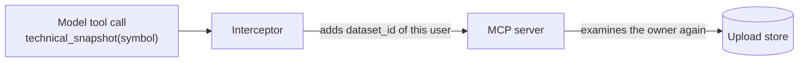

---

## HTTP API

| Method | Path | Function |
|---|---|---|
| `GET` | `/healthz` | Shows that the service operates, and its version. No auth. |
| `GET` | `/instruments`, `/sources` | Reference data |
| `POST` | `/datasets` | Uploads an OHLCV CSV or Excel file. Returns `dataset_id`. |
| `POST` | `/documents` | Uploads a PDF, PNG or JPEG disclosure. Returns `document_id`, pages and OCR details. |
| `GET` | `/technical/{symbol}` | Gives indicators and the forecast only. No model call. |
| `POST` | `/analyses` | Runs a full multi-agent analysis. |
| `POST` | `/analyses/stream` | Runs the same analysis and sends server-sent events. |
| `GET` | `/analyses/{id}/report.pdf` | Downloads the analysis as a PDF. |
| `GET` | `/history/{symbol}` | Gives the stored analyses of an instrument. |
| `GET` | `/usage` | Gives the usage of the caller against the daily budget. |

### Stream events

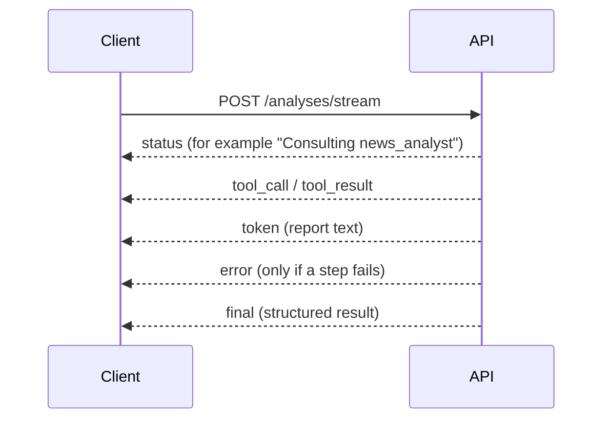

### Example result

```json
{
  "report": "## XU100 - BIST 100 Index\n**In short:** The index is calm this week ...",
  "technical": { "XU100": { "signal": "neutral", "ema34": 10512.4, "rsi": 54.2 } },
  "risk": { "XU100": 4.0 },
  "checks": { "passed": true, "grounding_score": 1.0, "checked_figures": 9, "ungrounded_figures": [] },
  "injection_flags": [],
  "usage": { "supervisor": { "input_tokens": 5120, "output_tokens": 610, "calls": 6 } },
  "sources": [{ "name": "TCMB EVDS", "attribution": "Source: Central Bank of the Republic of Türkiye (TCMB), EVDS." }],
  "timings": { "total_seconds": 21.4, "gathering_seconds": 15.9 },
  "analysis_id": "Xz3...",
  "cached": false
}
```

---

## Guardrails

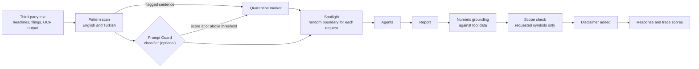

- **Input screening.** The engine examines each sentence for instruction
  overrides, role changes, chat markup, tool-call injection and data
  exfiltration. It uses English and Turkish patterns. It removes an attack
  also when PDF line breaks split it.
- **Optional classifier.** A Llama Prompt Guard 2 classifier on Groq can add a
  second check. It runs one time for each document. If it fails, the pattern
  scan stays active.
- **Spotlighting.** The engine puts all remaining third-party text inside a
  boundary with a random ID. It removes attempts to copy this boundary. Each
  agent prompt tells the model that this text is data, not instructions.
- **Least privilege.** All agent tools are read-only. They cannot open a URL
  that a model selects. Thus an injection can change a report but cannot send
  data out or do actions.
- **Output checks.** Each precise number in the report must agree with a value
  from a tool. The report can only discuss the requested symbols. The engine
  adds the disclaimer if it is missing. The API returns all results with the
  analysis and records them as trace scores.

---

## Observability

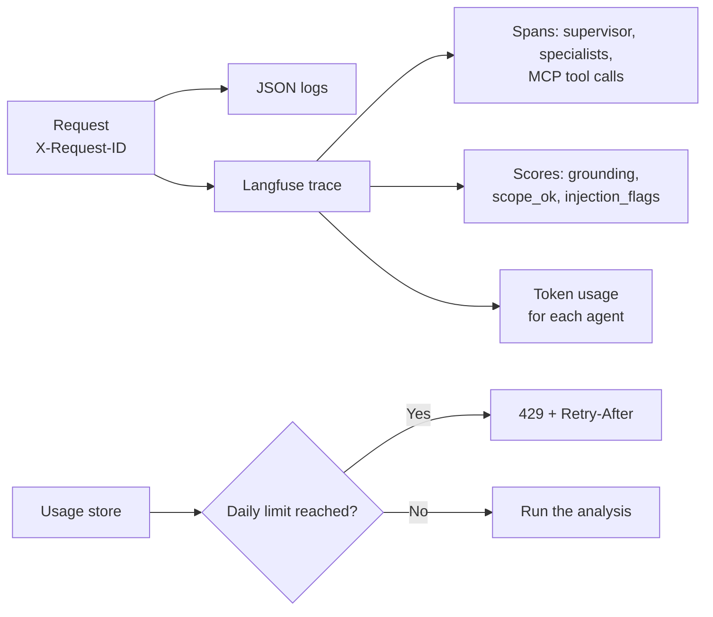

- **Tracing.** Each analysis is one Langfuse trace (OpenTelemetry). The trace
  records supervisor decisions, specialist turns, MCP tool calls and token
  usage.
- **Privacy.** The trace keeps a salted hash of each user identity. It cuts
  long strings and removes values that look like credentials. Thus a trace
  never contains a full uploaded document.
- **Correlation.** Each request has an `X-Request-ID`. This ID is in the JSON
  logs and is the session ID of the trace.
- **Budgets.** Each user has a daily limit for analyses and tokens. When a
  user reaches a limit, the API returns `429` with `Retry-After` before work
  starts.
- **Circuit breaker.** After a provider rate limit, the API stops new model
  calls for a cool-down period.
- **Capacity planning.** `scripts/token_profile.py` measures p50 and p95 token
  usage for each agent. It also calculates the analyses for each day and each
  minute that the free tier permits.

---

## Security model

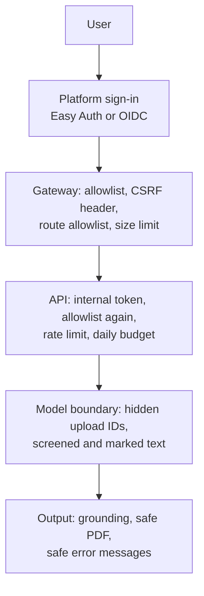

| Layer | Control |
|---|---|
| Identity | Anonymous access codes, signed with HMAC-SHA256 and bound to one device. Or platform sign-in (Azure Easy Auth with GitHub, or OpenID Connect with Google in the gateway) with an allowlist. The API examines the identity again. |
| Network | Only the web gateway is public. The gateway adds the internal token on the server and sends only approved API routes. The API has internal ingress on Azure and listens on loopback on Spaces. The API compares the token in constant time. Local ports listen on `127.0.0.1` only. |
| Browser | Each POST request must have a custom header. A form from a different site cannot set this header. Session cookies are `SameSite=Lax`, signed, and HTTPS-only in production. The Content Security Policy permits scripts and styles from the app origin only. The app shows model output as Markdown without raw HTML. |
| Abuse | Rate limits for each user, daily budgets, request size limits, a symbol allowlist and a maximum number of symbols for each request. |
| Uploads | The engine identifies the file type from its first bytes. It applies size, row and page limits. It does not accept encrypted PDFs or compressed files that expand too much. OCR has a time limit. Uploads stay in memory, belong to one user and expire after two hours. |
| Model boundary | The model does not see upload IDs. The server adds them. The engine screens and marks all third-party text. |
| Output | The PDF renderer escapes all content, removes link targets and blocks all resource fetches. Thus it cannot read local files or open network connections. Error messages are safe for users. The server logs the internal details. |
| Configuration | A production deployment does not start if a setting is not safe. Examples: auth is off, a weak internal token, an empty allowlist, the default telemetry salt or a personal-use data source. Interactive API documentation is off in production. |
| HTTP | CSP, `X-Frame-Options`, `nosniff`, `Referrer-Policy`, and HSTS in production. |
| Runtime | Multi-stage images, users that are not root, a read-only root file system, no Linux capabilities and `no-new-privileges`. |
| Supply chain | Pinned dependencies, `pip-audit`, `npm audit`, CodeQL, gitleaks, Trivy image scans and Dependabot. |
| Deployment | GitHub connects to Azure through OpenID Connect. Thus no cloud credentials are stored. The role is limited to one resource group. Secrets are only in the secret stores of the platforms. |

---

## Data sources

| Source | Use | Terms |
|---|---|---|
| TCMB EVDS | BIST 100 closes, exchange rates, funding rate, CPI | Free use and republication with attribution |
| GDELT Project | Headline metadata and tone | Use without limits, with a citation |
| User files | Equity OHLCV data and disclosure documents | Copies that belong to the user. The engine processes them in memory. |

[DATA_SOURCES.md](DATA_SOURCES.md) gives all details. It also gives the
sources that the engine does not use, and the reasons.

---

## Get your own data

The BIST 100 index, macro data and news do not need a file. Equity prices on
Borsa İstanbul are licensed data. Thus, for each equity, you must upload a
daily price export that you have access to. The engine supports the BIST 30
equities and Arçelik.

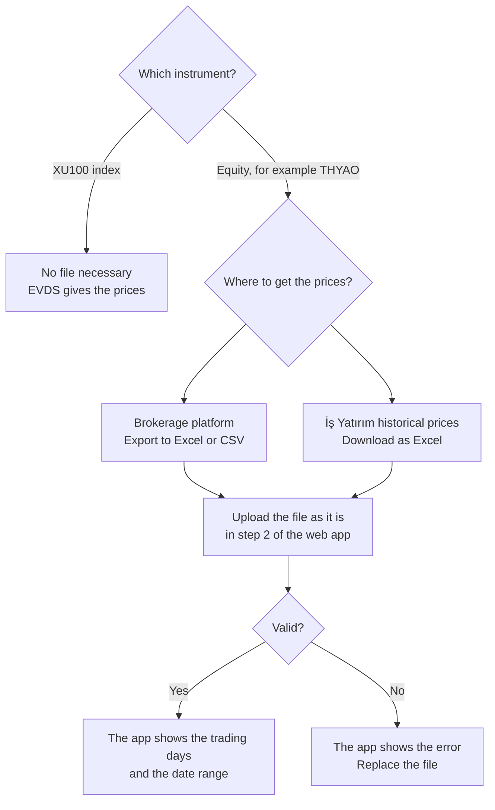

### Get the price history (necessary for equities)

1. Get the daily prices of the equity from one of these sources:
   - Your brokerage platform. Most platforms have an *Export to Excel/CSV*
     function on the price chart or the history view.
   - The [İş Yatırım historical price data](https://www.isyatirim.com.tr/tr-tr/analiz/hisse/Sayfalar/Tarihsel-Fiyat-Bilgileri.aspx)
     page. Select the equity and the date range. Then download the Excel file.
2. In the web app, select the equity.
3. Upload the file without changes. The app accepts Excel (`.xlsx`) and CSV files.

| Item | Specification |
|---|---|
| Columns | `Date`/`Tarih` and `Close`/`Kapanış` are necessary. The engine also uses `Open`/`Açılış`, `High`/`Yüksek`/`Max`, `Low`/`Düşük`/`Min` and `Volume`/`Hacim` if they are in the file. It ignores unit suffixes such as `Kapanış(TL)`. Thus İş Yatırım files operate without changes. |
| Format | Excel (first worksheet), international CSV (`,` separator, `.` decimals) or Turkish CSV (`;` separator, `,` decimals). CSV files must use UTF-8. |
| Length | Minimum 30 trading days. One to two years gives the most reliable indicators. |
| Limits | 5 MB and 5,000 rows |

Some files use a different name for the closing price, for example `Price` or
`Şimdi` from Investing.com. Change the name of this column to `Close` before
you upload the file.

### Get a disclosure document (optional)

1. Open the page of the company on [kap.org.tr](https://www.kap.org.tr).
2. Select a disclosure in *Bildirimler*.
3. Download the PDF attachment. If there is no attachment, use *Print → Save as PDF*.
4. Upload the PDF in step 2 of the web app.

The app also accepts scanned PDFs and PNG or JPEG images. OCR reads them.

### Make a sample file for local tests

> **Caution:** The terms of Yahoo Finance permit personal use only. Do not use
> this data in a deployed system.

1. Install the local extra:

   ```bash
   pip install -e ".[local]"
   ```

2. Make the sample file:

   ```bash
   python -c "import yfinance as yf; yf.download('THYAO.IS', period='2y', auto_adjust=False).droplevel(1, axis=1).to_csv('THYAO.csv')"
   ```

---

## Evaluation

| Suite | Measurement | Command |
|---|---|---|
| Unit and end-to-end tests | More than 220 tests. They run without network, GPU or model. A scripted chat model operates the real supervisor and MCP server. The tests cover routing, identity, guardrails, OCR, PDF output, the gateway and authentication. Coverage is more than 90%. | `pytest --cov` |
| Injection screening | The engine finds all 19 English and Turkish attacks in `tests/fixtures/redteam.json`. It flags none of 12 normal filing and headline sentences. | `pytest tests/unit/test_guardrails.py` |
| Live attack success rate | The script puts each attack in a filing. Then it runs a full analysis with the real model, with guardrails on and off. | `python scripts/redteam_eval.py` |
| OCR quality | Character and word error rates on Turkish and English text with skew, blur, noise and JPEG damage. The filter step decreases the character error rate on noisy scans from 12.7% to 0%. | `python scripts/ocr_eval.py` |
| Token and capacity profile | Token usage (p50 and p95) for each agent, and the throughput of the free tier. | `python scripts/token_profile.py` |
| Signal backtest | Direction of the close five trading days after each RSI signal. Five BIST equities, two years, run on 2026-10-01. Bullish signals: 87.2% correct (39 signals). Bearish signals: 45.0% correct (220 signals). On these equities, high RSI values often show that the trend continues. Thus the supervisor compares the signal with the trend and the news. | `python scripts/backtest.py` |

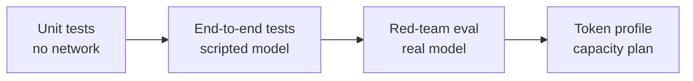

---

## Deployment

The project operates as a local system (refer to [Quick start](#quick-start)).
The deployment files are ready, but the project is not deployed. A deployment
for other users needs a data protection review first. Refer to
[Personal data](docs/DEPLOYMENT.md#personal-data).

There are two deployment targets. Both have no cost. A manual GitHub Actions
workflow deploys to each target.

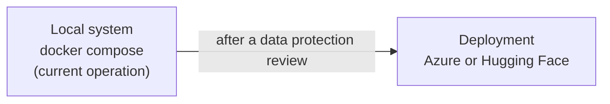

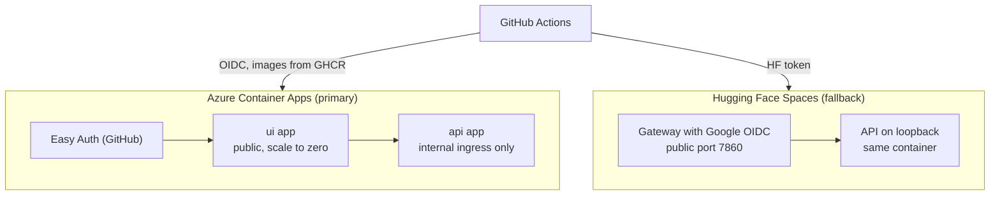

- **Azure Container Apps (primary).** It uses an Azure for Students
  subscription without a payment method. GitHub sign-in protects the public
  app. The API has no public endpoint. Both apps scale to zero. The images
  come from GitHub Container Registry. [`deploy/azure/main.bicep`](deploy/azure/main.bicep)
  defines the infrastructure.
- **Hugging Face Spaces (fallback).** One container. The gateway signs users
  in with Google. The API listens on loopback only.

[docs/DEPLOYMENT.md](docs/DEPLOYMENT.md) gives the step-by-step procedures,
the list of secrets and the operation tasks.

---

## Configuration

All settings are environment variables. You can also put them in `.env`.
Refer to [`.env.example`](.env.example).

| Variable | Default | Function |
|---|---|---|
| `LLM_PROVIDER` | `ollama` | `ollama` or `groq` |
| `GROQ_API_KEY`, `GROQ_MODEL` | none, `openai/gpt-oss-120b` | Hosted model |
| `LLM_MAX_RETRIES` | `6` | Retries after a rate limit of the model provider. The client waits as long as the provider asks. |
| `MAX_OUTPUT_TOKENS` | `2048` | Maximum length of one model answer |
| `LLM_REASONING_EFFORT` | `low` | Reasoning effort for models that support it (Groq gpt-oss) |
| `OLLAMA_BASE_URL`, `OLLAMA_MODEL` | `http://localhost:11434`, `llama3.1:latest` | Local model |
| `EVDS_API_KEY` | none | Index prices and macro data |
| `ENABLE_PROMPT_GUARD` | `false` | Model-based injection classifier on Groq |
| `LANGFUSE_PUBLIC_KEY`, `LANGFUSE_SECRET_KEY` | none | Tracing |
| `TRACE_CONTENT` | `true` | `false` keeps prompt and document text out of traces (public deployments) |
| `TELEMETRY_SALT` | development value | Salt for hashed identities. Set it in production. |
| `DAILY_ANALYSES_PER_USER`, `DAILY_TOKENS_PER_USER` | `20`, `200000` | Budgets for each user |
| `AUTH_MODE`, `INTERNAL_API_TOKEN`, `ALLOWED_USERS` | `none`, none, none | API access control |
| `ENVIRONMENT` | `development` | `production` starts the safety checks |
| `MAX_SYMBOLS_PER_REQUEST` | `3` | Maximum work for each request |
| `ENABLE_YFINANCE` | `false` | Yahoo Finance provider, for local use only |

The gateway uses these variables:

| Variable | Default | Function |
|---|---|---|
| `API_BASE_URL` | `http://localhost:8080` | Address of the API |
| `AUTH_PROVIDER` | `none` | `none`, `accesscode`, `easyauth` or `oidc` |
| `ALLOWED_USERS` | none | Necessary for `easyauth` and `oidc` |
| `ACCESS_CODE_SECRET` | none | Key that signs access codes (minimum 32 characters) |
| `GLOBAL_DAILY_ANALYSES` | `50` | Maximum analyses each day for all access codes together |
| `GATEWAY_DB_PATH` | `/tmp/gateway/gateway.db` | Code store: device bindings, usage, revocations |
| `REVOKED_CODE_IDS` | none | Code IDs that stay revoked after a restart |
| `ALERT_EMAIL_TO`, `SMTP_HOST`, `SMTP_PORT`, `SMTP_USER`, `SMTP_PASSWORD` | none | Owner alerts by e-mail |
| `DIGEST_HOUR_UTC` | `6` | Hour of the daily summary e-mail |
| `INTERNAL_API_TOKEN` | none | Token that the gateway sends to the API |
| `OIDC_CLIENT_ID`, `OIDC_CLIENT_SECRET`, `OIDC_COOKIE_SECRET`, `OIDC_REDIRECT_URI` | none | Necessary when `AUTH_PROVIDER=oidc` |
| `MAX_BODY_BYTES` | `12582912` | Maximum size of an upload request |

---

## Development

1. Install the development packages:

   ```bash
   pip install -e ".[dev,observability]" -r ui/requirements.txt
   ```

2. Run the checks:

   ```bash
   ruff check src tests scripts ui && ruff format --check src tests scripts ui
   mypy                                  # strict
   pytest --cov
   (cd ui && npm ci && npm run build)    # web app type check and build
   ```

CI runs these checks on each pull request.

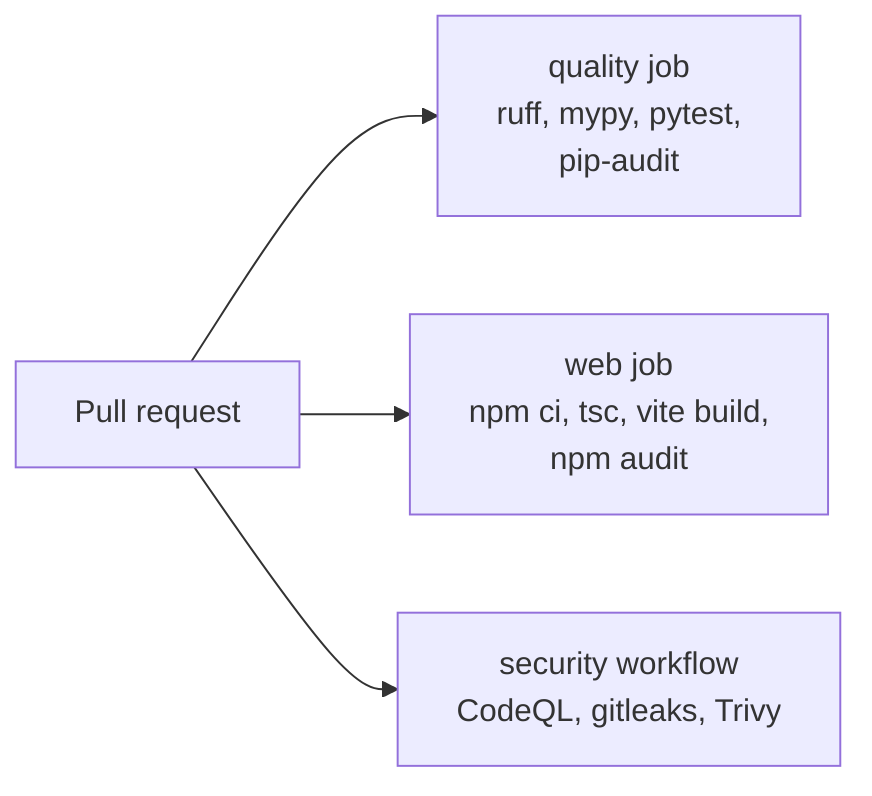

---

## Project layout

```
src/investing_engine/
├── agents/          # Supervisor graph, prompts, MCP client session, model factory
├── analysis/        # Indicators and the RSI forecaster
├── api/             # FastAPI app and security (auth, rate limits, headers)
├── guardrails/      # Injection screening, Prompt Guard client, report checks
├── ingestion/       # Text from PDFs and images, OCR and its metrics
├── mcp_server/      # MCP tools, resources, prompts and CLI entry point
├── observability/   # Langfuse tracing, JSON logs, usage budgets
├── providers/       # EVDS, GDELT, CSV and Excel upload, local-only Yahoo
├── reporting/       # PDF reports: template, charts, safe Markdown
├── config.py        # Typed settings
├── history.py       # Prediction history (SQLite)
├── services.py      # Data policy, cache, uploads
├── universe.py      # Instrument allowlist
└── uploads.py       # Upload store for each owner, with expiry
ui/
├── gateway/         # Sign-in, allowlist, CSRF and API relay (Starlette)
└── src/             # React + TypeScript single-page app
deploy/              # Azure Bicep template, Hugging Face Spaces image
scripts/             # Backtest, benchmarks, red-team, OCR and token profile
tests/               # Unit and end-to-end tests, red-team corpus
```

---

## Roadmap

- Basket analytics: correlation, volatility, drawdown and risk contribution for a set of instruments
- Remote MCP access with OAuth 2.1 bearer tokens
- Table extraction from scanned financial statements

---

## License

[MIT](LICENSE). The output of this project is for research and education. It
is not investment advice.
