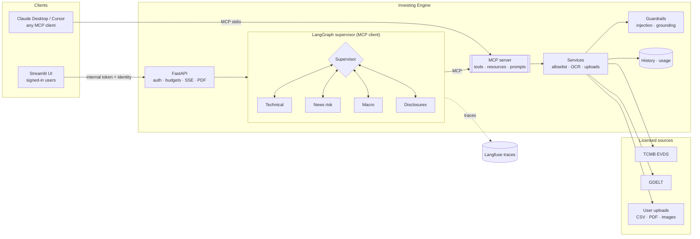
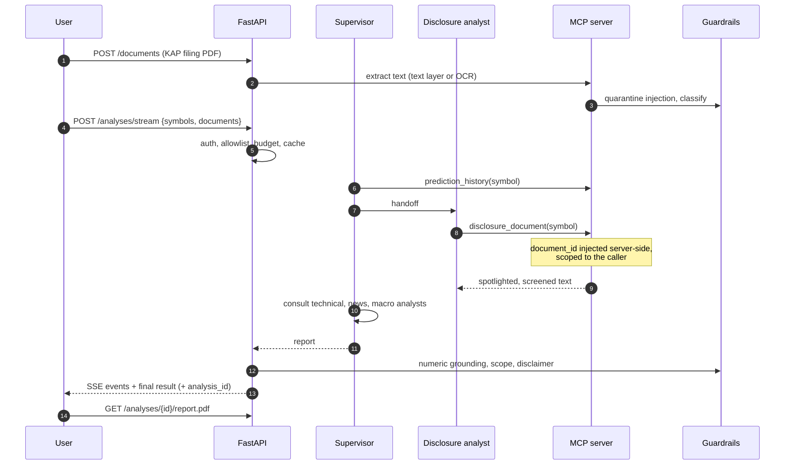
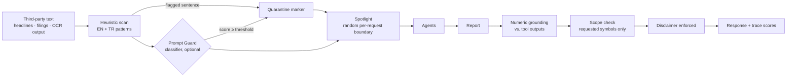

# Investing Engine

[](https://github.com/MuhammetAliVarlik/AgenticInvestingEngine/actions/workflows/tests.yml)
[](https://github.com/MuhammetAliVarlik/AgenticInvestingEngine/actions/workflows/security.yml)


**An MCP-native, multi-agent research engine for Borsa İstanbul.** A LangGraph
supervisor coordinates four specialist agents (technical analysis, headline
risk, the Turkish macro backdrop and company disclosures) and writes a single
grounded report. Every capability is published as a
[Model Context Protocol](https://modelcontextprotocol.io) server, so the same
tools power the engine's own agents, Claude Desktop, Cursor or any other MCP
client.

The system is built for production use from the start. Prompt-injection
defences screen all third-party text. Every figure in a report is checked
against tool output. Scanned filings are read with OCR, analyses are traced
end to end, and reports download as PDFs. Access is controlled with
authentication, per-user budgets and licensed data sources only. It runs on a
local model (Ollama) or a hosted one (Groq) with a single setting.

---

## Contents

- [Highlights](#highlights)
- [Architecture](#architecture)
- [Quick start](#quick-start)
- [Use it from Claude Desktop](#use-it-from-claude-desktop)
- [MCP reference](#mcp-reference)
- [HTTP API](#http-api)
- [Guardrails](#guardrails)
- [Observability](#observability)
- [Security model](#security-model)
- [Data sources](#data-sources)
- [Evaluation](#evaluation)
- [Deployment](#deployment)
- [Configuration](#configuration)
- [Development](#development)
- [Project layout](#project-layout)
- [Roadmap](#roadmap)

---

## Highlights

| Area | What it does |
|---|---|
| **MCP server + client** | Eight tools, three resources and a prompt over stdio and Streamable HTTP. The engine's agents discover the same tools over the protocol via `langchain-mcp-adapters`, exactly as an external client would. |
| **Supervisor routing** | The supervisor's own LLM turns decide which specialist to consult and when to write the report. Each specialist receives only the tools it needs. |
| **Document intelligence** | Disclosure PDFs and images are read through the text layer, with Tesseract OCR (Turkish + English) for scanned pages, with preprocessing for noisy scans. |
| **Guardrails** | Prompt-injection screening (heuristics plus an optional Llama Prompt Guard classifier), spotlighting of untrusted text, numeric grounding of every figure, scope checks and an enforced disclaimer. |
| **Observability** | Langfuse (OpenTelemetry) traces with quality scores, privacy-preserving masking, per-agent token accounting, structured JSON logs with request IDs. |
| **Cost control** | Per-user daily analysis and token budgets, a provider circuit breaker, capped graph steps and output length, response caching. |
| **Reports** | Downloadable PDF with KPI tiles, price/EMA/Bollinger and RSI charts, indicator tables, risk history, quality checks and source attribution. |
| **Access control** | Platform sign-in (Azure Easy Auth or OIDC), user allowlist, an internal-only API with token authentication, rate limiting and a fail-closed production configuration. |
| **Licensed data** | TCMB EVDS, GDELT and user-supplied files only; each source carries its terms and attribution in code. |
| **Zero-cost hosting** | Azure Container Apps (scale-to-zero, GHCR images) with a Hugging Face Spaces fallback, both deployed by GitHub Actions. |

---

## Architecture



### One analysis, end to end



---

## Quick start

**Requirements:** Python 3.10+, Tesseract (`tesseract-ocr`, `tesseract-ocr-tur`),
and either a [Groq API key](https://console.groq.com) (free) or
[Ollama](https://ollama.com). A free [EVDS API key](https://evds3.tcmb.gov.tr)
enables index prices and macro data.

```bash
git clone https://github.com/MuhammetAliVarlik/AgenticInvestingEngine.git
cd AgenticInvestingEngine
python -m venv .venv && source .venv/bin/activate
pip install -e ".[dev,observability]" -r ui/requirements.txt
cp .env.example .env        # set LLM_PROVIDER and add GROQ_API_KEY, EVDS_API_KEY
python scripts/verify_evds_series.py   # optional: confirm EVDS series codes
```

```bash
uvicorn investing_engine.api.main:app --port 8080
API_BASE_URL=http://localhost:8080 streamlit run ui/streamlit_app.py
```

Or with Docker:

```bash
docker compose up --build                     # hosted LLM (Groq)
docker compose --profile ollama up --build    # local LLM (Ollama, NVIDIA GPU)
```

| Service | URL |
|---|---|
| Streamlit UI | http://localhost:8501 |
| API + OpenAPI docs | http://localhost:8080/docs |

---

## Use it from Claude Desktop

```json
{
  "mcpServers": {
    "investing-engine": {
      "command": "/absolute/path/to/.venv/bin/investing-engine-mcp",
      "env": { "EVDS_API_KEY": "your-key" }
    }
  }
}
```

Then ask, for example: *"Use the investment_report prompt for XU100."* To
explore the server interactively:

```bash
npx @modelcontextprotocol/inspector .venv/bin/investing-engine-mcp
```

---

## MCP reference

### Tools

| Tool | Description | Annotations |
|---|---|---|
| `list_instruments` | Supported instruments and whether public prices exist | read-only |
| `technical_snapshot(symbol, dataset_id?)` | EMA34/89, MACD, Bollinger %B, RSI and RSI-Fibonacci levels; ATR, ADX, Stochastic and OBV with OHLCV; RandomForest next-period RSI forecast mapped to a signal | read-only |
| `macro_snapshot` | USD/TRY, EUR/TRY, CBRT funding rate and CPI inflation with recent changes | read-only |
| `news_headlines(symbol, days?, limit?)` | Screened headline metadata and GDELT average tone | read-only |
| `disclosure_document(symbol, document_id?)` | Screened text of an uploaded filing with extraction and OCR details | read-only |
| `prediction_history(symbol, limit?)` | The engine's previous analyses of an instrument | read-only |
| `upload_price_csv(symbol, csv_text)` | Register the caller's own daily OHLCV export | write, caller-scoped |
| `upload_document(symbol, filename, content_base64)` | Register a PDF/PNG/JPEG filing; scanned pages are OCR'd | write, caller-scoped |

### Resources and prompts

| URI / name | Content |
|---|---|
| `instruments://universe` | All supported instruments |
| `sources://attribution` | Active data sources, their terms and attribution |
| `history://{symbol}` | Full analysis timeline for an instrument |
| prompt `investment_report(symbol)` | Guided multi-source research workflow |

Upload identifiers never reach the engine's own agents: they are stripped from
the tool schemas the model sees and injected server-side by a tool-call
interceptor for the authenticated caller.

---

## HTTP API

| Method | Path | Purpose |
|---|---|---|
| `GET` | `/healthz` | Liveness and version (unauthenticated) |
| `GET` | `/instruments` · `/sources` | Reference data |
| `POST` | `/datasets` | Upload an OHLCV CSV → `dataset_id` |
| `POST` | `/documents` | Upload a disclosure (PDF/PNG/JPEG) → `document_id`, pages, OCR details |
| `GET` | `/technical/{symbol}` | Indicators and forecast only, no LLM |
| `POST` | `/analyses` | Full multi-agent analysis |
| `POST` | `/analyses/stream` | The same as server-sent events |
| `GET` | `/analyses/{id}/report.pdf` | Download the analysis as a PDF |
| `GET` | `/history/{symbol}` | Stored analysis timeline |
| `GET` | `/usage` | The caller's consumption against today's budget |

```json
{
  "report": "## XU100 - BIST 100 Index\n**Technical view:** neutral - ...",
  "technical": { "XU100": { "signal": "neutral", "ema34": 10512.4, "rsi": 54.2 } },
  "risk": { "XU100": 4.0 },
  "checks": { "passed": true, "grounding_score": 1.0, "checked_figures": 9, "ungrounded_figures": [] },
  "injection_flags": [],
  "usage": { "supervisor": { "input_tokens": 5120, "output_tokens": 610, "calls": 6 } },
  "sources": [{ "name": "TCMB EVDS", "attribution": "Source: Central Bank of the Republic of Türkiye (TCMB), EVDS." }],
  "timings": { "total_seconds": 21.4, "gathering_seconds": 15.9 },
  "analysis_id": "Xz3...",
  "cached": false
}
```

---

## Guardrails



- **Input screening.** Instruction overrides, role manipulation, smuggled
  chat markup, tool-call injection and exfiltration patterns in English and
  Turkish are detected sentence by sentence. Payloads split by PDF line wrapping
  are removed whole. An optional Llama Prompt Guard 2 classifier on Groq adds
  model-based detection. It runs once per document and fails open to the
  heuristic layer.
- **Spotlighting.** Remaining third-party text is wrapped in a boundary with a
  random per-request id; any attempt to forge the boundary is neutralised, and
  every agent prompt treats the content as data.
- **Least privilege.** Tools are read-only and cannot fetch arbitrary URLs.
  Even a successful injection can only distort a report, never exfiltrate data
  or take actions.
- **Output checks.** Every precise figure in the report must match a value a
  tool returned (within the rounding shown). Sections are limited to the
  requested symbols. The not-investment-advice disclaimer is enforced. Results
  are returned with the analysis and recorded as trace scores.

---

## Observability

- **Tracing:** each analysis is a Langfuse trace (OpenTelemetry) covering
  supervisor decisions, specialist turns, MCP tool calls and token usage, with
  `grounding`, `scope_ok` and `injection_flags` scores attached.
- **Privacy:** user identities are salted hashes. Traced payloads have long
  strings truncated and credential-like values redacted, so uploaded documents
  are never exported in full.
- **Correlation:** every request carries an `X-Request-ID` that appears in JSON
  logs and as the trace session id.
- **Budgets:** per-user daily analysis and token budgets return `429` with
  `Retry-After` before any work starts. After a provider rate limit, a circuit
  breaker fails fast for a cool-down period. Graph steps and output tokens are
  capped.
- **Capacity planning:** `scripts/token_profile.py` reports per-agent p50/p95
  token usage and the analyses per day and per minute the free tier allows.

---

## Security model

| Layer | Control |
|---|---|
| Identity | Platform sign-in (Azure Easy Auth with GitHub, or Streamlit OIDC with Google) followed by an allowlist check in the UI and again in the API. |
| Network | Only the UI is public. The API has internal ingress (Azure) or binds to loopback (Spaces) and requires a shared internal token, compared in constant time. Local ports bind to `127.0.0.1`. |
| CSRF | Browser-side protection comes from Streamlit's XSRF tokens. The API authenticates with header tokens rather than cookies, so a cross-site request cannot carry credentials. |
| Abuse | Per-user rate limiting, daily budgets, request size limits, symbol allowlist and a cap on symbols per request. |
| Uploads | Magic-byte type detection, size, row and page limits, encrypted-PDF rejection, decompression-bomb guard, OCR timeouts. Uploads stay in memory, are owner-scoped and expire after two hours. |
| Model boundary | Upload ids are hidden from the model and injected server-side; third-party text is screened and spotlighted. |
| Output | PDF rendering escapes all content, drops link targets and blocks every resource fetch (no SSRF or local file reads). Errors are user-safe; internals are logged server-side only. |
| Configuration | A production deployment refuses to start with auth disabled, a weak internal token, an empty allowlist, the default telemetry salt or a personal-use data source enabled. Interactive docs are disabled in production. |
| HTTP | CSP, `X-Frame-Options`, `nosniff`, `Referrer-Policy`, HSTS in production. |
| Runtime | Multi-stage images, non-root users, read-only root filesystem, all capabilities dropped, `no-new-privileges`. |
| Supply chain | Pinned dependencies, `pip-audit`, CodeQL, gitleaks, Trivy image scanning and Dependabot. |
| Deployment | GitHub → Azure via OpenID Connect (no stored cloud credentials), role scoped to one resource group, secrets only in platform secret stores. |

---

## Data sources

| Source | Used for | Terms |
|---|---|---|
| TCMB EVDS | BIST 100 closes, FX, funding rate, CPI | Free use and republication with attribution |
| GDELT Project | Headline metadata and tone | Unrestricted use with citation |
| User uploads | Equity OHLCV, disclosure documents | The user's own copies, processed in memory |

Details, including sources deliberately excluded, are in
[DATA_SOURCES.md](DATA_SOURCES.md).

---

## Evaluation

| Suite | What it measures | How to run |
|---|---|---|
| Unit and end-to-end tests | 220+ tests in a few minutes, without network, GPU or LLM. A scripted chat model drives the real supervisor and MCP server, covering routing, identity propagation, guardrails, OCR, PDF rendering and authentication. Coverage above 90%. | `pytest --cov` |
| Injection screening | 19 English and Turkish attacks from `tests/fixtures/redteam.json` are all detected, and none of 12 realistic filing and headline sentences are flagged. | `pytest tests/unit/test_guardrails.py` |
| Live attack success rate | Each attack is embedded in a filing and a full analysis is run with the real LLM, with guardrails on and off. | `python scripts/redteam_eval.py` |
| OCR quality | CER/WER on Turkish and English passages under skew, blur, noise and JPEG degradation. Median-filter preprocessing brings CER on noisy synthetic scans from 12.7% to 0%. | `python scripts/ocr_eval.py` |
| Token and capacity profile | Per-agent p50/p95 tokens and free-tier throughput. | `python scripts/token_profile.py` |
| Signal backtest | Direction of the close five trading days after each RSI-threshold signal (5 BIST names, two years, run 2026-10-01): bullish 87.2% over 39 signals, bearish 45.0% over 220. Overbought readings on these names tend to mark momentum continuation, which is why the supervisor weighs the signal against trend and news. | `python scripts/backtest.py` |

---

## Deployment

Two zero-cost targets, deployed by manual GitHub Actions workflows:

- **Azure Container Apps (primary).** Uses an Azure for Students subscription
  with no payment method. The public UI sits behind GitHub sign-in and the API
  is internal-only. Both scale to zero and pull images from GitHub Container
  Registry. Infrastructure is defined in [`deploy/azure/main.bicep`](deploy/azure/main.bicep).
- **Hugging Face Spaces (fallback).** A single container with Google sign-in
  and the API on loopback.

Step-by-step instructions, the secret checklist and operations notes are in
[docs/DEPLOYMENT.md](docs/DEPLOYMENT.md).

---

## Configuration

All settings are environment variables (or `.env`); see [`.env.example`](.env.example).

| Variable | Default | Purpose |
|---|---|---|
| `LLM_PROVIDER` | `ollama` | `ollama` or `groq` |
| `GROQ_API_KEY` · `GROQ_MODEL` | – · `llama-3.3-70b-versatile` | Hosted inference |
| `OLLAMA_BASE_URL` · `OLLAMA_MODEL` | `http://localhost:11434` · `llama3.1:latest` | Local inference |
| `EVDS_API_KEY` | – | Index prices and macro data |
| `ENABLE_PROMPT_GUARD` | `false` | Model-based injection classifier on Groq |
| `LANGFUSE_PUBLIC_KEY` · `LANGFUSE_SECRET_KEY` | – | Enable tracing |
| `TELEMETRY_SALT` | dev value | Salt for hashed identities (set in production) |
| `DAILY_ANALYSES_PER_USER` · `DAILY_TOKENS_PER_USER` | `20` · `200000` | Per-user budgets |
| `AUTH_MODE` · `INTERNAL_API_TOKEN` · `ALLOWED_USERS` | `none` · – · – | API access control |
| `ENVIRONMENT` | `development` | `production` enables fail-closed checks |
| `MAX_SYMBOLS_PER_REQUEST` | `3` | Upper bound on work per request |
| `ENABLE_YFINANCE` | `false` | Local-only Yahoo Finance provider |

---

## Development

```bash
pip install -e ".[dev,observability]" -r ui/requirements.txt
ruff check src tests scripts ui && ruff format --check src tests scripts ui
mypy                      # strict
pytest --cov
```

CI runs linting, formatting, strict type-checking and the test suite with
coverage, plus a dependency audit. A separate security workflow runs CodeQL,
gitleaks and Trivy.

---

## Project layout

```
src/investing_engine/
├── agents/          # Supervisor graph, prompts, MCP client session, LLM factory
├── analysis/        # Indicator engineering and the RSI forecaster
├── api/             # FastAPI app and security (auth, rate limits, headers)
├── guardrails/      # Injection screening, Prompt Guard client, report checks
├── ingestion/       # PDF/image text extraction, OCR and its metrics
├── mcp_server/      # MCP tools, resources, prompts and CLI entry point
├── observability/   # Langfuse tracing, JSON logging, usage budgets
├── providers/       # EVDS, GDELT, CSV upload, local-only Yahoo
├── reporting/       # PDF reports: template, charts, safe Markdown
├── config.py        # Typed settings
├── history.py       # Prediction history (SQLite)
├── services.py      # Data-licensing policy, caching, uploads
├── universe.py      # Instrument allowlist
└── uploads.py       # Owner-scoped, expiring upload store
ui/                  # Streamlit front end and sign-in
deploy/              # Azure Bicep template, Hugging Face Spaces image
scripts/             # Backtest, benchmarks, red-team, OCR and token profiling
tests/               # Unit and end-to-end tests, red-team corpus
```

---

## Roadmap

- Basket analytics: correlation, volatility, drawdown and risk contribution for a user-defined set of instruments
- Remote MCP access with OAuth 2.1 bearer tokens
- Table extraction from scanned financial statements

---

## License

[MIT](LICENSE). Outputs are for research and education and are not investment advice.
