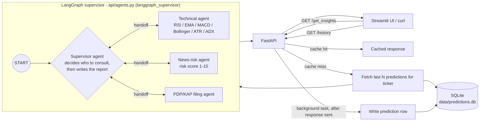

# 🤖 AgenticInvestingEngine

An **agentic multi-agent investment analysis system** for BIST100 stocks — a LangGraph supervisor architecture coordinates specialist agents for technical analysis, news-risk assessment, and regulatory filing review, then synthesizes their findings into a single investment report. Runs entirely on your own machine via Docker; your market data and generated reports never leave it.

> **GPU required.** LLM inference runs via Ollama with NVIDIA GPU support (`runtime: nvidia` in `docker-compose.yml`). The default `llama3.1:latest` model benefits from 6GB+ VRAM; see [Model choice](#-model-choice) for a lighter-weight option on smaller GPUs.

---

## 🚀 Features

- 🧠 **Agentic multi-agent architecture** — a genuine LangGraph supervisor decides which of three specialist agents (technical, news-risk, PDP/KAP filings) to consult and in what order, then writes the final report itself — see [Architecture](#-architecture)
- 📊 **Technical analysis agent** — RSI (next-period prediction via a cached RandomForest model), EMA34/89 crossover, MACD, Bollinger Bands, ATR, ADX, OBV, Stochastic, and a bespoke RSI-Fibonacci divergence indicator
- 📰 **News-risk agent** — scores recent news 1–10 with reasoning
- 🧾 **PDP/KAP filing agent** — matches disclosures to the requested ticker in code before they ever reach the model
- 🧭 **Decision-driven routing** — the supervisor consults each specialist through its own real tool-call handoffs, live, rather than following a fixed pipeline
- 🕰️ **Prediction history & memory** — every analysis is persisted to a local SQLite database, and the next analysis for the same ticker is shown its own recent history so the report can call out meaningful shifts ("this is a shift from the neutral signal three days ago...")
- 🚀 **In-process response cache** so re-requesting the same ticker doesn't re-run the full pipeline
- 🖥️ **Streamlit UI** — enter a ticker, see the rendered report, risk gauge, and a prediction-history timeline chart, not raw JSON
- 🧠 **Live "inner thoughts" streaming** — the UI shows each agent's tool calls, tool results, and reasoning tokens as they're generated in real time via server-sent events, straight from the graph's own execution
- 🌐 RESTful API powered by **FastAPI**

---

## 🧱 Architecture



The supervisor is the only node reachable from `START`, and it's a genuine decision-maker, not a fixed pipeline: each turn, its own LLM call decides — via its own tool-calls — whether to hand off to one of the three specialist agents next, or to stop and write the final report. A specialist agent is never invoked except by the supervisor's own decision, and never calls another specialist directly. This is built on `langgraph_supervisor.create_supervisor`, which wires each specialist agent behind a handoff tool bound to the supervisor's model — so routing is the supervisor's runtime choice, exactly like this project's original architecture, not something hardcoded into the graph's shape.

---

## 📂 Project Structure
```
.
├── docker-compose.yml
├── ollama/                    # Ollama model setup (pulls llama3.1:latest)
├── api/
│   ├── main.py                 # FastAPI app: routes, caching, history orchestration
│   ├── agents.py                # LangGraph supervisor: decision-making routing + specialist agents
│   ├── db.py                     # SQLite prediction-history persistence
│   ├── cache.py                   # In-process TTL response cache
│   ├── tools/                      # Technical analysis / news / PDP tools
│   └── tests/                       # pytest suite (mocked LLM/network, runs in seconds)
├── ui/
│   ├── streamlit_app.py         # Report viewer, live "inner thoughts" streaming, history timeline
│   └── Dockerfile
├── scripts/
│   ├── benchmark.py            # Latency benchmarking against a running API
│   └── backtest.py              # Rule-based RSI-signal backtest (see Accuracy notes)
└── data/                    # Bind-mounted SQLite database (persists across restarts)
```

---

## ⚙️ Setup

**Requirements:**
- Docker
- NVIDIA Container Toolkit (GPU required — see note above)

**Launch:**
```bash
cp api/.env.example api/.env
docker compose up --build
```

Once running:
- Ollama pulls `llama3.1:latest` on first start via `ollama/pull-llama3.sh`
- FastAPI is served at `http://localhost:8080`
- Streamlit UI is served at `http://localhost:8501`
- Ollama's own API is reachable at `http://localhost:11434`
- Prediction history persists in `./data/predictions.db` on the host, bind-mounted into the API container, so it survives container restarts

### Setup timing

| Step | Approx. time | Notes |
|---|---|---|
| `docker compose build` (api + ui images) | ~1–2 min | Plain Python image builds |
| Ollama image build + first `llama3.1:latest` pull | ~5–15 min | ~4.9GB download, varies with connection speed; not re-pulled on subsequent starts |
| First `/get_insights` request (cold, no cached RSI model) | See below | Downloads OHLCV, trains a small RandomForest, runs the agent graph |
| Repeat request for the same ticker within the cache window | **~9ms** (measured) | Served straight from the in-process cache, no LLM call at all |

A single `rsi_predictor` tool call (OHLCV download + RandomForest train/predict, no LLM involved) takes **~1.4s** measured directly. Full-pipeline latency (the supervisor's routing decisions, each specialist agent it consults, and the final synthesis) is dominated by LLM inference and scales with model size, hardware, and GPU availability — run `python scripts/benchmark.py --ticker THYAO.IS --n 5 --url http://localhost:8080` to measure it on your own setup.

---

## 🎛 Model choice

`OLLAMA_MODEL` in `api/.env` controls which model every agent uses:

- **`llama3.1:latest`** (shipped default, ~4.9GB) — recommended for the most reliable tool-calling and instruction-following.
- **`llama3.2:3b`** (~2.6GB) — a lighter option for modest GPUs. Smaller models trade some reliability for speed and lower VRAM requirements, so `llama3.1:latest` remains the recommended default wherever hardware allows.

---

## 📡 API Endpoints

### `GET /`
Health check.
```json
{ "message": "🎉 FastAPI working!" }
```

### `GET /get_insights?ticker_list=THYAO.IS,ARCLK.IS`
Runs the full agent graph (or returns a cached report from the last cache window) and returns a consolidated report per ticker. Add `&debug=true` to include a `stages` field with per-stage timing.

```json
{
  "output": "📊 Ticker: THYAO.IS\n🔍 Technical Summary:\n- Signal: neutral\n- EMA34: ₺314.85\n- EMA89: ₺312.74\n..."
}
```

Every non-cached call also persists a row to the prediction-history database in the background (after the response is already sent, so a database issue never breaks the response) and, if prior predictions exist for a ticker, feeds a compact summary of them back into the supervisor's prompt so the report can call out meaningful shifts.

### `GET /get_insights/stream?ticker_list=THYAO.IS`
Server-sent-events variant of `/get_insights`, powering the Streamlit UI's "inner thoughts" panel. Streams live progress straight from the graph's own execution — each time the supervisor decides to consult an agent, which tool that agent is calling, each tool's result, and every agent's (including the supervisor's own) reasoning tokens as they're generated. Persists history and populates the cache the same way `/get_insights` does once the stream completes. Event shapes:

```
data: {"type": "status", "text": "Supervisor is consulting stock_price_expert..."}
data: {"type": "tool_call", "agent": "stock_price_expert", "tool": "rsi_predictor"}
data: {"type": "tool_result", "agent": "stock_price_expert", "tool": "rsi_predictor"}
data: {"type": "token", "agent": "stock_price_expert", "text": "The technical setup "}
data: {"type": "status", "text": "Supervisor is writing the final report..."}
data: {"type": "token", "agent": "merge", "text": "📊 Ticker: THYAO.IS\n\n"}
data: {"type": "final", "output": "...", "raw": {...}}
```

### `GET /stock_price?ticker=THYAO.IS`
Runs just the technical-analysis tool (RSI prediction, EMA34/89, MACD, Bollinger, etc.) — no LLM call, fast.

### `GET /history?ticker=THYAO.IS`
Returns the stored prediction history for a ticker (timestamp, signal, risk score, EMA values, one-line summary), oldest first.

---

## 🕰️ Prediction history & agent memory

Every `/get_insights` call (that isn't a cache hit) writes one row to `data/predictions.db`:

`id, ticker, timestamp, signal, risk_score, ema34, ema89, price_at_prediction, rsi_divergence, summary_text`

Only derived/summary fields are stored — never the raw scraped news or PDP filing text (see [Data sources](#-data-sources--usage-notes) below). Before generating a new report, the last 5 predictions for each requested ticker are fetched and summarized into the supervisor's prompt (e.g. *"3 days ago — Neutral, risk 4/10; 7 days ago — Bearish, risk 6/10"*), giving the agent memory of its own past analysis so it can note when today's signal represents a real shift.

The Streamlit UI's history panel charts risk score over time per ticker and shows a plain table of past predictions; a ticker with no prior history shows that plainly instead of an empty chart.

**Planned enhancement:** a manually-runnable self-scoring script that checks whether past predictions were directionally correct once enough time has passed, using `price_at_prediction` against the current price.

---

## 🧪 Tests & CI

```bash
pip install -r api/requirements-dev.txt
pytest
```

83 tests, runtime ~30-45s — no network access, GPU, or Ollama instance required. Every test mocks the LLM with a fake chat model bound to the real `create_react_agent`/`create_supervisor` machinery, so the actual handoff/routing orchestration runs end-to-end in every test, just without a live model. The suite covers the technical-indicator math (including the RSI signal threshold boundaries and the Bollinger `%B` divide-by-zero guard), the news/PDP tools against fixture HTML, the supervisor graph's structure and genuine decision-making (it can skip, reorder, or repeat an expert) and streaming behavior, the prediction-history database, and the FastAPI routes.

Wired into GitHub Actions (`.github/workflows/tests.yml`) on every push/PR.

---

## 📈 Accuracy notes

The technical-analysis signal (`classify_signal` in `api/tools/stockPriceAnaliserTool.py`) is a rule-based threshold on a RandomForest's next-period RSI prediction. Unit tests lock in the exact threshold behavior (RSI < 30 → bullish, > 70 → bearish) and the EMA34/89 crossover logic against known input/output pairs.

`scripts/backtest.py` runs a rule-based backtest of the RSI-threshold signal against ~2 years of real historical OHLCV data for 5 BIST100 tickers (THYAO, ASELS, TUPRS, VESTL, BAYRK), checking whether price moved in the signaled direction 5 trading days later:

```
Overall bullish hit rate:  76.1% over 67 signals
Overall bearish hit rate:  44.0% over 193 signals
```

Breaking this down per ticker shows *why*: three of the five tickers exhibit momentum continuation rather than mean-reversion after an overbought RSI reading, which explains the asymmetry between the bullish and bearish sides of the signal.

| Ticker | Overbought (RSI>70) signals | Mean 5d forward return | % positive |
|---|---|---|---|
| THYAO.IS | 29 | +0.09% | 51.7% |
| ASELS.IS | 83 | +2.13% | 62.7% |
| TUPRS.IS | 48 | +1.57% | 56.2% |
| VESTL.IS | 7 | −3.56% | 42.9% |
| BAYRK.IS | 26 | −6.62% | 34.6% |

Reproduce with `python scripts/backtest.py`.

---

## 🔒 Data sources & usage notes

- **Yahoo Finance** (`yfinance`) — OHLCV price/volume history and recent news summaries. Used here for personal research only.
- **BloombergHT** (`api/tools/PDPTool.py`) — scrapes BloombergHT's public KAP-news aggregation pages for recent disclosure summaries; not a direct connection to KAP (Turkey's official Public Disclosure Platform) itself. Each candidate disclosure's own page heading (formatted `TICKER/Full Company Name`) is matched against the requested ticker in code before it's returned, so an unrelated company's disclosure is never handed to the agent as if it were about the requested one.
- Nothing scraped is cached or redistributed beyond the current request, with one exception: the prediction-history database (`data/predictions.db`), which stores only your own generated analysis output (signal, risk score, indicator values, a short summary) — never the raw scraped news or filing text.
- **This project is for personal research only. Nothing it outputs is financial advice.**

---

## 🧠 Tech Stack
- `FastAPI` – REST API
- `LangChain + LangGraph (langgraph_supervisor)` – agentic multi-agent orchestration: a supervisor agent that decides, via real tool-call handoffs, which `create_react_agent` specialist to consult and when to write the final report — see [Architecture](#-architecture)
- `ChatOllama` – local LLM inference
- `Streamlit + Plotly` – report and history UI
- `SQLite` – prediction-history persistence
- `scikit-learn` + `ta` – RSI prediction model and technical indicators
- `Docker + NVIDIA Runtime` – containerized GPU deployment

---

## 🧪 Example Usage

```bash
curl "http://localhost:8080/get_insights?ticker_list=ARCLK.IS,VESTL.IS"
curl "http://localhost:8080/history?ticker=ARCLK.IS"
```

Or open `http://localhost:8501` for the Streamlit UI.

---
## 🛠 Contributing
Feel free to contribute!

---
## 📄 License
This project is licensed under the MIT License.
