# Deployment

> **Note:** This document uses ASD-STE100 Simplified Technical English.

> **Caution:** The project is ready to deploy, but it is not deployed. It
> operates as a local system. Do not run the deploy workflows before you read
> [Personal data](#personal-data) and get a data protection review.

Investing Engine has two deployment targets. Both have no cost. Both use the
same code and the same security model.

| Item | Azure Container Apps (primary) | Hugging Face Spaces (fallback) |
|---|---|---|
| Account | Azure for Students (no credit card) | Free Hugging Face account |
| Sign-in (default) | Anonymous access codes | Anonymous access codes |
| Sign-in (option) | Container Apps built-in auth (GitHub) | Gateway OpenID Connect (Google) |
| Topology | Public web app, internal API | One container: public gateway, API on loopback |
| Scale | Scale to zero, maximum one replica | The Space stops when nobody uses it |
| Workflow | `.github/workflows/deploy-azure.yml` | `.github/workflows/deploy-hf-spaces.yml` |

You start each workflow manually in the **Actions** tab of the repository.

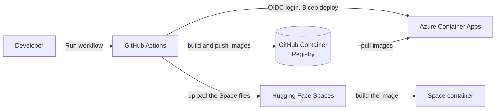

---

## Sign-in modes

The web gateway sets the sign-in mode with `AUTH_PROVIDER`.

| Mode | Who can sign in | Personal data | Use |
|---|---|---|---|
| `none` | Everybody on the local computer | None | Local system (`docker compose`) |
| `accesscode` | Holders of an access code from the owner | None | Default for deployments |
| `easyauth` | GitHub accounts on the allowlist (Azure only) | E-mail or GitHub user name | Option |
| `oidc` | Google accounts on the allowlist (Spaces) | E-mail address | Option |

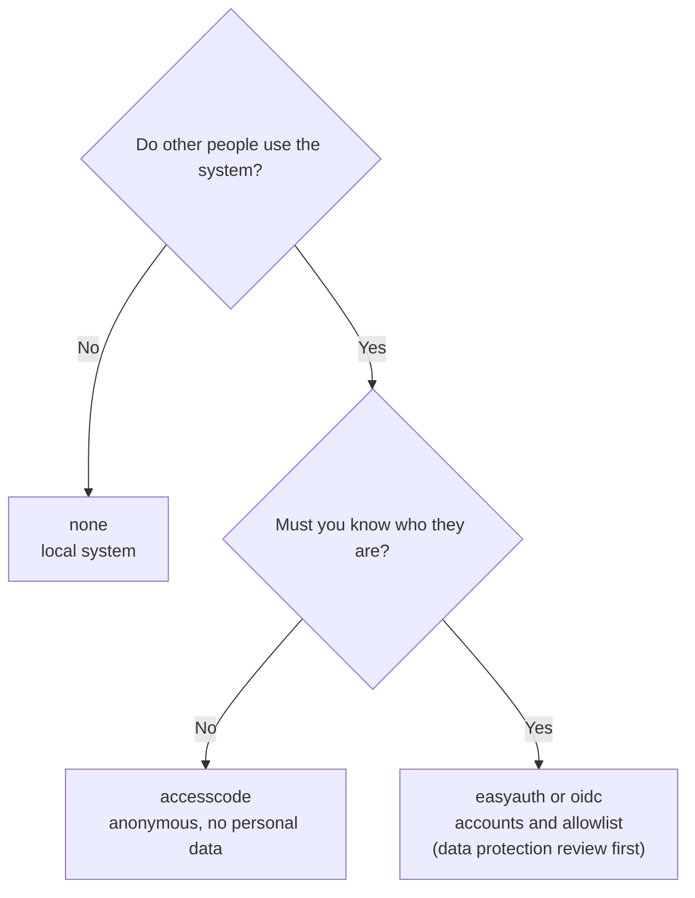

---

## Anonymous access codes

### How a code operates

The owner makes access codes with a command. A code contains a random ID, an
expiry time and an analysis quota. A secret key (`ACCESS_CODE_SECRET`) signs
the code. Thus the gateway can examine a code without a database, and nobody
can change or make a code without the key.

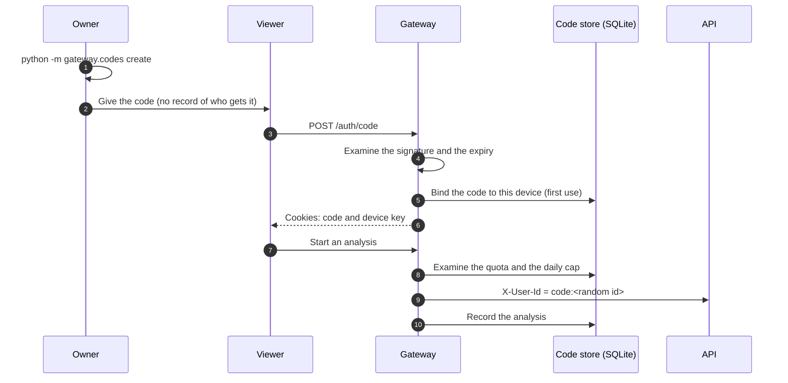

### Rules

| Rule | Function |
|---|---|
| Signature | The gateway does not accept a code that is changed or that is signed with a different key. |
| Expiry | A code stops at its expiry time. Default: 7 days. |
| Quota | A code can start a maximum number of analyses. Default: 10. |
| One device | The first browser that uses a code keeps it. A second device cannot use the same code. |
| Revocation | The owner can stop a code immediately. |
| Daily cap | All codes together can start a maximum of `GLOBAL_DAILY_ANALYSES` analyses each day (default 50). |
| No documents | The gateway does not accept document uploads in this mode. Documents can contain personal data. |
| No content in traces | The API sends no prompt or document text to the tracing backend (`TRACE_CONTENT=false`). |
| No access logs | The gateway does not write IP addresses to its logs. |

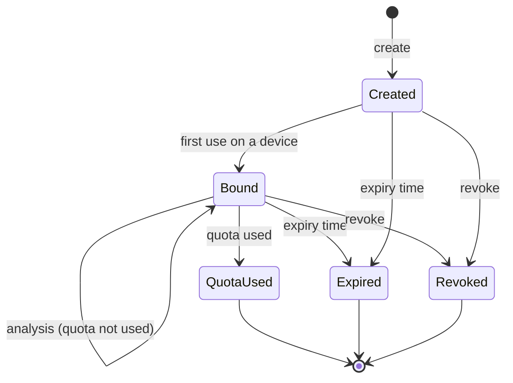

### Make, list and revoke codes

Run the commands where the gateway runs. `ACCESS_CODE_SECRET` must have the
same value as in the gateway.

- Local Docker system:

  ```bash
  docker compose exec ui python -m gateway.codes create --days 7 --quota 10 --count 3
  docker compose exec ui python -m gateway.codes list
  docker compose exec ui python -m gateway.codes revoke a3f9c2d1
  ```

- Azure:

  ```bash
  az containerapp exec -g $RG -n invengine-ui --command "python -m gateway.codes list"
  ```

> **Note:** On the local Docker system, the code store is in the `gateway`
> volume. Usage counts, device bindings and revocations stay after a restart.
> To delete them, run `docker compose down -v`.
>
> **Note:** On Azure and Spaces the code store is in a temporary file system.
> If the container stops, the store goes back to empty: device bindings, usage
> counts and revocations are lost. Signed codes stay valid until they expire.
> To keep a revocation after a restart, add the code ID to `REVOKED_CODE_IDS`.

> **Warning:** Keep `ACCESS_CODE_SECRET` secret. A person with this key can
> make valid codes. If the key leaks, set a new key. All old codes then stop.

### Try access codes on the local system

```bash
AUTH_PROVIDER=accesscode ACCESS_CODE_SECRET=$(python -c "import secrets; print(secrets.token_urlsafe(32))") \
  docker compose up --build
```

Then make a code with `docker compose exec ui python -m gateway.codes create`.
Use the same shell, so that the command gets the same secret.

---

## Owner alerts

The gateway can send e-mail alerts to the owner. The alerts contain no
personal data: no IP address, no code and no content. They identify a code
only by the first eight characters of its random ID.

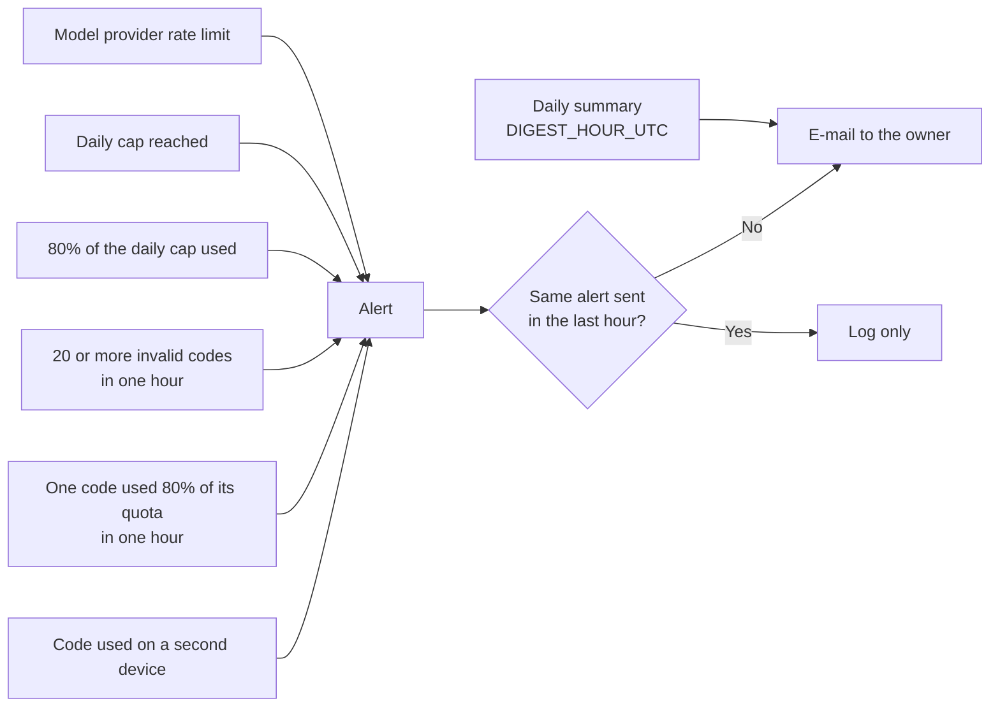

| Variable | Function |
|---|---|
| `ALERT_EMAIL_TO` | Address of the owner. If it is empty, alerts go to the log only. |
| `SMTP_HOST`, `SMTP_PORT` | Mail server. Port 587 uses STARTTLS, port 465 uses TLS. |
| `SMTP_USER`, `SMTP_PASSWORD` | Mail account. For Gmail, use an app password. |
| `ALERT_EMAIL_FROM` | Sender address. Default: `SMTP_USER`. |
| `DIGEST_HOUR_UTC` | Hour of the daily summary. Default: 6. An empty value stops the summary. |

To use Gmail:

1. In your Google account, start 2-step verification.
2. Make an app password (**Google account → Security → App passwords**).
3. Set `SMTP_HOST=smtp.gmail.com`, `SMTP_USER=<your address>` and `SMTP_PASSWORD=<app password>`.

---

## Request flow

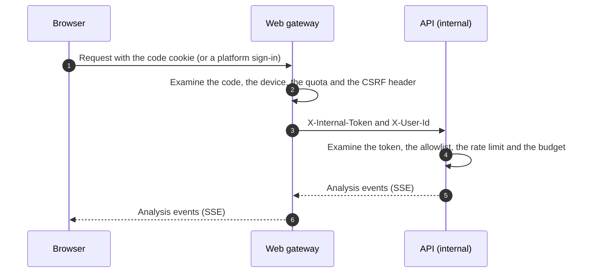

---

## Cost model

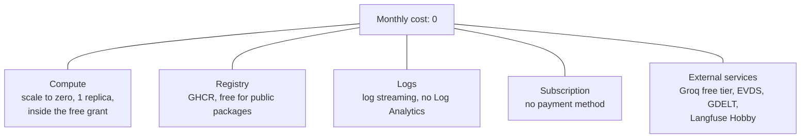

- **Compute.** Both apps scale to zero. Each app has a maximum of one
  replica. Thus the usage stays inside the monthly free grant of the
  Container Apps consumption plan.
- **Registry.** The workflow pushes the images to GitHub Container Registry.
  This registry is free for public packages. Thus the template does not make
  an Azure Container Registry.
- **Logs.** The template does not make a Log Analytics workspace. Use log
  streaming.
- **Billing safety.** An Azure for Students subscription has no payment
  method. When the credit or the term ends, Azure disables the subscription.
  The subscription cannot make charges.
- **Model and data.** The Groq free tier, EVDS and GDELT have no cost.
  Langfuse Hobby has no cost.

---

## Azure: one-time setup

### Prerequisites

- Azure CLI (`az`).
- An active Azure for Students subscription.
- Admin rights on the GitHub repository.

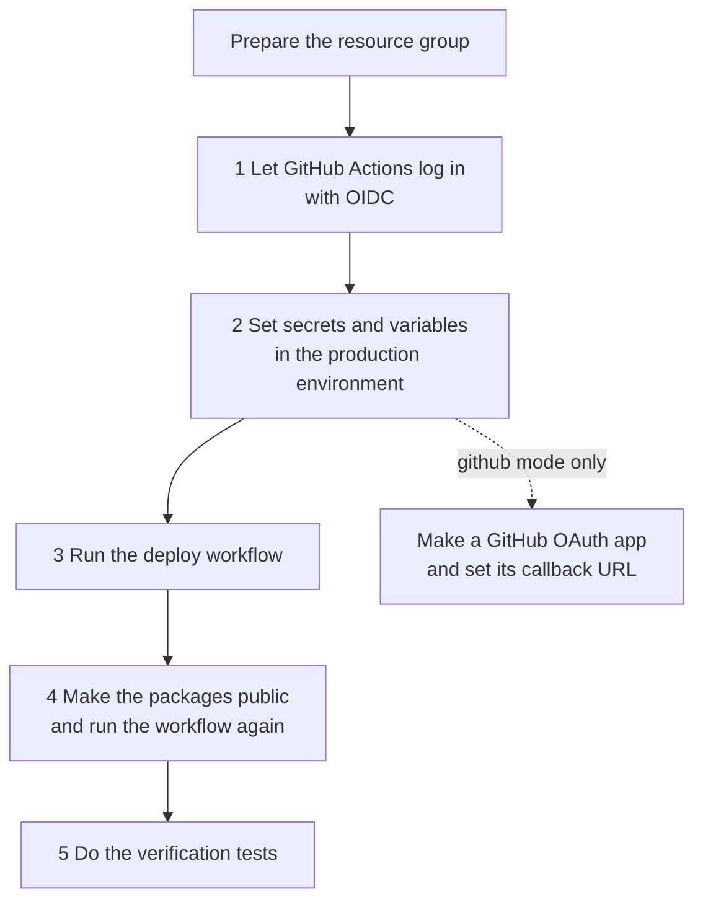

### Prepare the resource group

1. Log in to Azure:

   ```bash
   az login
   ```

2. Set the variables and make the resource group:

   ```bash
   SUB=$(az account show --query id -o tsv)
   RG=investing-engine-rg
   az group create --name $RG --location westeurope
   az provider register --namespace Microsoft.App
   ```

### Step 1: Let GitHub Actions log in with OIDC

This step lets GitHub Actions deploy without a stored cloud credential.

1. Make the application and the service principal:

   ```bash
   APP_ID=$(az ad app create --display-name investing-engine-deploy --query appId -o tsv)
   az ad sp create --id $APP_ID
   ```

2. Give the role. The role is limited to one resource group:

   ```bash
   az role assignment create --assignee $APP_ID --role Contributor \
     --scope /subscriptions/$SUB/resourceGroups/$RG
   ```

3. Add the federated credential. Replace `<github-user>` with your GitHub user name:

   ```bash
   az ad app federated-credential create --id $APP_ID --parameters '{
     "name": "github-production",
     "issuer": "https://token.actions.githubusercontent.com",
     "subject": "repo:<github-user>/AgenticInvestingEngine:environment:production",
     "audiences": ["api://AzureADTokenExchange"]
   }'
   ```

### Step 2: Set secrets and variables

1. In the repository, go to **Settings → Secrets and variables → Actions**.
2. Make an environment with the name `production`.
3. Add these items to the `production` environment:

| Type | Name | Value |
|---|---|---|
| Secret | `AZURE_CLIENT_ID` | `$APP_ID` |
| Secret | `AZURE_TENANT_ID` | `az account show --query tenantId -o tsv` |
| Secret | `AZURE_SUBSCRIPTION_ID` | `$SUB` |
| Secret | `INTERNAL_API_TOKEN` | `python -c "import secrets; print(secrets.token_urlsafe(48))"` |
| Secret | `ACCESS_CODE_SECRET` | A different random value (minimum 32 characters) |
| Secret | `TELEMETRY_SALT` | A different random value |
| Secret | `GROQ_API_KEY` | From console.groq.com |
| Secret | `EVDS_API_KEY` | From evds3.tcmb.gov.tr |
| Secret | `SMTP_PASSWORD` | Optional, for owner alerts |
| Secret | `LANGFUSE_SECRET_KEY` | Optional |
| Variable | `AZURE_RESOURCE_GROUP` | `investing-engine-rg` |
| Variable | `SIGN_IN_MODE` | `accesscode` (default) or `github` |
| Variable | `GLOBAL_DAILY_ANALYSES` | Optional, default `50` |
| Variable | `ALERT_EMAIL_TO`, `SMTP_HOST`, `SMTP_USER` | Optional, for owner alerts |
| Variable | `LANGFUSE_PUBLIC_KEY` | Optional |

For `github` mode only, also add:

| Type | Name | Value |
|---|---|---|
| Secret | `GH_OAUTH_CLIENT_SECRET` | Client secret of the GitHub OAuth app |
| Variable | `GH_OAUTH_CLIENT_ID` | Client ID of the GitHub OAuth app |
| Variable | `ALLOWED_USERS` | For example `github:your-user` |

> **Warning:** Do not put a secret value in a variable. GitHub shows variable
> values in the workflow logs.

### Step 3: Run the deploy workflow

1. Go to **Actions → Deploy to Azure**.
2. Push **Run workflow**.

### Step 4: Make the packages public

Container Apps can pull only public GHCR packages.

1. In GitHub, go to **Packages**.
2. For each `investing-engine-*` package, go to **Package settings → Change visibility**.
3. Set the visibility to **Public**.
4. Run the deploy workflow again.

### Step 5: Do the verification tests

1. Make sure that the API has no public endpoint:

   ```bash
   az containerapp show -g $RG -n invengine-api --query properties.configuration.ingress.external
   # The result must be: false
   ```

2. Make sure that the web app asks for an access code:

   ```bash
   curl -s https://<ui-fqdn>/api/me      # {"detail": "Sign-in required", ..., "method": "code"}
   ```

3. Make a code (refer to [Make, list and revoke codes](#make-list-and-revoke-codes)) and run an analysis.
4. Open the app on a second device with the same code. Make sure that the app refuses it.

### GitHub mode only: OAuth app

1. In GitHub, go to **Settings → Developer settings → OAuth Apps**. Make a new OAuth app.
2. After the first deployment, find `githubCallbackUrl` in the workflow log.
3. Set this URL as the callback URL of the OAuth app.

---

## Azure: operation tasks

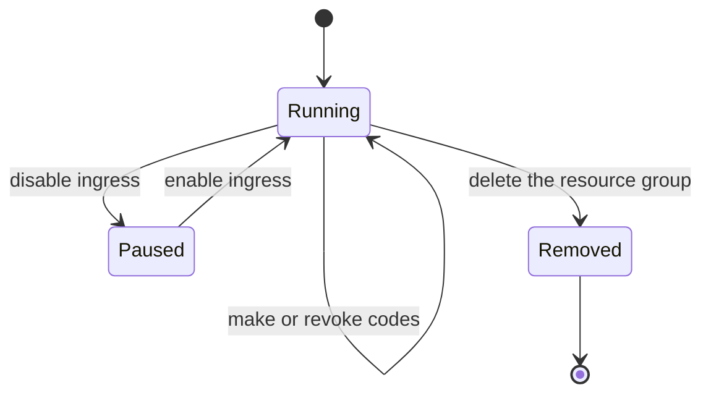

| Task | Procedure |
|---|---|
| Give access | Make a code. Give it without a record of the receiver. |
| Stop a code | `python -m gateway.codes revoke <id>`. For a permanent stop, also add the ID to `REVOKED_CODE_IDS`. |
| Stop all codes | Set a new `ACCESS_CODE_SECRET`. Run the workflow again. |
| Rotate a secret | Change the secret in GitHub. Run the workflow again. For an emergency, also rotate the key at the provider (Groq, EVDS or Langfuse). |
| Pause the demo | `az containerapp ingress disable -g $RG -n invengine-ui` |
| Remove all resources | `az group delete --name $RG` |

> **Note:** The containers keep the history and the code store in a temporary
> file system. They go back to empty when the apps scale to zero.

---

## Hugging Face Spaces: fallback

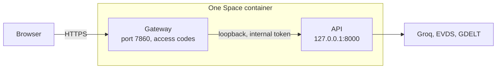

1. Make a Space. Set the SDK to **Docker** and the hardware to **CPU basic**.
2. In the Space settings, add these **secrets**:
   - `GROQ_API_KEY`, `EVDS_API_KEY`, `TELEMETRY_SALT`, `ACCESS_CODE_SECRET`
   - `SMTP_PASSWORD` and `LANGFUSE_*` (optional)
3. In the Space settings, add these **variables** (optional): `GLOBAL_DAILY_ANALYSES`,
   `ALERT_EMAIL_TO`, `SMTP_HOST`, `SMTP_USER`.
4. In GitHub, make an environment with the name `hf-spaces`. Add:
   - The secret `HF_TOKEN` (a token with write access).
   - The variable `HF_SPACE_ID` (`<user>/<space>`).
5. Go to **Actions → Deploy to Hugging Face Spaces**. Push **Run workflow**.

For Google sign-in instead of access codes, set the variable
`AUTH_PROVIDER=oidc` and add `OIDC_CLIENT_ID`, `OIDC_CLIENT_SECRET`,
`OIDC_COOKIE_SECRET`, `OIDC_REDIRECT_URI`
(`https://<space-subdomain>.hf.space/oauth2callback`) and `ALLOWED_USERS`.

The container makes a new internal API token at each start. The API listens
on loopback only. Thus users can only get to the web gateway.

---

## Local stack

1. Copy the configuration file:

   ```bash
   cp .env.example .env
   ```

2. Start the containers:

   ```bash
   docker compose up --build                   # API and web app, Groq
   docker compose --profile ollama up --build  # with a local Ollama model
   ```

3. Open http://localhost:8501.

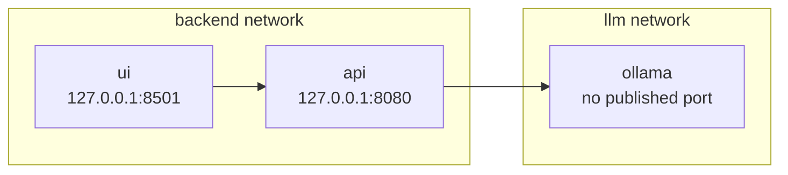

On a local system, `AUTH_MODE=none` and `AUTH_PROVIDER=none`. A production
configuration (`ENVIRONMENT=production`) does not start without
authentication, an allowlist and strong secrets.

---

## Personal data

> **Warning:** Get legal advice before you deploy the system for other
> people. KVKK (Law No. 6698) and, for users in the EU, the GDPR can apply.

The current operation of this project is **local only**:

- The owner runs the system on a local computer with `docker compose`.
- The owner shows the system through screen sharing or a recorded video.
- Viewers do not get access. Thus the system processes no personal data of
  other people.

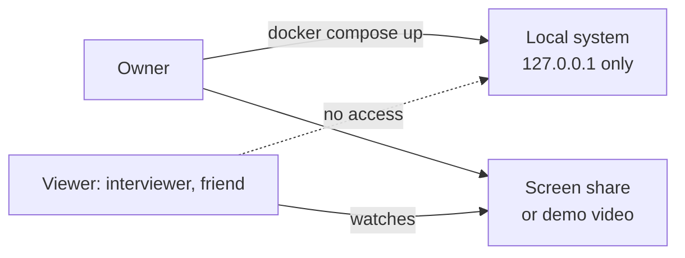

The `accesscode` mode is designed to keep personal data to a minimum:

| Data | In `accesscode` mode |
|---|---|
| Name, e-mail address, account | Not collected |
| Access code | Random ID only. The system does not record who received it. |
| IP address | Not in the application logs. The hosting platform can keep technical logs. |
| Documents | Upload is off. |
| Prompt and document text | Not sent to the tracing backend. |
| Price files | In memory, maximum two hours, for one code only. |
| Analysis results | Analyses that use a price file of the user: visible to the same code only. Analyses of public data (XU100): shared, with no user data. |
| Owner alerts | No personal data. |

These measures decrease the risk, but they do not replace legal advice. The
platform logs of Azure or Hugging Face and the transfer of prompts to the
model provider (Groq) outside Türkiye need a review.

---

## Remote MCP

The Streamable HTTP transport of the MCP server listens on loopback only.
Desktop clients connect through stdio. Refer to the README. The hosted demo
does not give remote MCP access.
