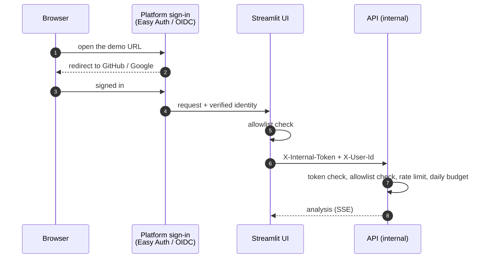

# Deployment

Investing Engine ships with two zero-cost hosting targets that run the same
code and the same security model:

| | Azure Container Apps (primary) | Hugging Face Spaces (fallback) |
|---|---|---|
| Account | Azure for Students (no credit card) | Free Hugging Face account |
| Sign-in | Container Apps built-in auth (GitHub) | Streamlit OIDC (Google) |
| Topology | UI public, API internal-only | One container: UI public, API on loopback |
| Scaling | Scale to zero, max 1 replica | Sleeps when idle |
| Workflow | `.github/workflows/deploy-azure.yml` | `.github/workflows/deploy-hf-spaces.yml` |

Both are triggered manually from the **Actions** tab.

## Request flow



## Cost model

- **Compute:** both apps scale to zero and are capped at one replica, which
  keeps usage within the Container Apps consumption plan's monthly free grant.
- **Registry:** images are published to GitHub Container Registry, which is
  free for public packages, so no Azure Container Registry is created.
- **Logging:** no Log Analytics workspace is created; use log streaming.
- **Billing safety:** an Azure for Students subscription has no payment
  method attached. When its credit or term ends, the subscription is disabled;
  it cannot accrue charges. The Hugging Face fallback keeps the demo online.
- **LLM and data:** Groq free tier, EVDS and GDELT are free; Langfuse Hobby is free.

## Azure: one-time setup

Prerequisites: Azure CLI (`az`), an active Azure for Students subscription,
and admin rights on the GitHub repository.

```bash
az login
SUB=$(az account show --query id -o tsv)
RG=investing-engine-rg
az group create --name $RG --location westeurope
az provider register --namespace Microsoft.App
```

**1. Let GitHub Actions deploy without stored credentials (OIDC):**

```bash
APP_ID=$(az ad app create --display-name investing-engine-deploy --query appId -o tsv)
az ad sp create --id $APP_ID
az role assignment create --assignee $APP_ID --role Contributor \
  --scope /subscriptions/$SUB/resourceGroups/$RG
az ad app federated-credential create --id $APP_ID --parameters '{
  "name": "github-production",
  "issuer": "https://token.actions.githubusercontent.com",
  "subject": "repo:<github-user>/AgenticInvestingEngine:environment:production",
  "audiences": ["api://AzureADTokenExchange"]
}'
```

The role is scoped to the single resource group.

**2. Create a GitHub OAuth app** (GitHub → Settings → Developer settings → OAuth Apps):
use any homepage URL for now; the callback URL is printed by the first
deployment (`githubCallbackUrl` output), after which you update the app.

**3. Configure the repository** (Settings → Secrets and variables → Actions,
in an environment named `production`):

| Kind | Name | Value |
|---|---|---|
| Secret | `AZURE_CLIENT_ID` | `$APP_ID` |
| Secret | `AZURE_TENANT_ID` | `az account show --query tenantId -o tsv` |
| Secret | `AZURE_SUBSCRIPTION_ID` | `$SUB` |
| Secret | `GH_OAUTH_CLIENT_SECRET` | OAuth app client secret |
| Secret | `INTERNAL_API_TOKEN` | `python -c "import secrets; print(secrets.token_urlsafe(48))"` |
| Secret | `TELEMETRY_SALT` | another random value |
| Secret | `GROQ_API_KEY` | from console.groq.com |
| Secret | `EVDS_API_KEY` | from evds3.tcmb.gov.tr |
| Secret | `LANGFUSE_SECRET_KEY` | optional |
| Variable | `AZURE_RESOURCE_GROUP` | `investing-engine-rg` |
| Variable | `GH_OAUTH_CLIENT_ID` | OAuth app client id |
| Variable | `ALLOWED_USERS` | e.g. `github:your-user,github:interviewer` |
| Variable | `LANGFUSE_PUBLIC_KEY` | optional |

**4. Deploy:** Actions → *Deploy to Azure* → *Run workflow*. After the first
run, make both `investing-engine-*` packages public (GitHub → Packages →
Package settings → Change visibility) so Container Apps can pull them, then
re-run. Update the OAuth app's callback URL to the `githubCallbackUrl` output.

**5. Verify:**

```bash
curl -sI https://<ui-fqdn>/ | head -1        # 302 to the sign-in page
az containerapp show -g $RG -n invengine-api --query properties.configuration.ingress.external
# false: the API has no public endpoint
az containerapp logs show -g $RG -n invengine-api --follow
```

Sign in with an allowlisted GitHub account and run an analysis; sign in with a
non-allowlisted account and confirm access is refused.

### Operations

- **Invite or remove a user:** edit `ALLOWED_USERS` and re-run the workflow.
- **Rotate a secret:** update it in GitHub and re-run; for an emergency
  revocation, also rotate the key at the provider (Groq, EVDS, Langfuse).
- **Pause the demo:** `az containerapp ingress disable -g $RG -n invengine-ui`.
- **Remove everything:** `az group delete --name $RG`.

History is stored in the container's temporary filesystem and resets when the
app scales to zero; the demo is stateless by design.

## Hugging Face Spaces: fallback

1. Create a Space (SDK: Docker, hardware: CPU basic).
2. Create a Google OAuth client (Google Cloud Console → Credentials → OAuth
   client ID → Web application) with redirect URI
   `https://<space-subdomain>.hf.space/oauth2callback`.
3. In the Space settings add **secrets**: `GROQ_API_KEY`, `EVDS_API_KEY`,
   `TELEMETRY_SALT`, `OIDC_CLIENT_ID`, `OIDC_CLIENT_SECRET`,
   `OIDC_COOKIE_SECRET`, `OIDC_REDIRECT_URI`, optional `LANGFUSE_*`; and the
   **variable** `ALLOWED_USERS` (Google e-mail addresses).
4. In GitHub, create an environment `hf-spaces` with secret `HF_TOKEN` (a
   write token) and variable `HF_SPACE_ID` (`<user>/<space>`).
5. Actions → *Deploy to Hugging Face Spaces* → *Run workflow*.

The container generates its internal API token at boot and binds the API to
loopback, so only the authenticated Streamlit UI is reachable.

## Local stack

```bash
cp .env.example .env
docker compose up --build                   # API + UI, Groq
docker compose --profile ollama up --build  # with a local Ollama model
```

Locally `AUTH_MODE=none`; a production configuration (`ENVIRONMENT=production`)
refuses to start without authentication, an allowlist and strong secrets.

## Remote MCP

The MCP server's Streamable HTTP transport binds to loopback only. Desktop
clients connect over stdio (see the README); remote MCP access is not exposed
in the hosted demo.
