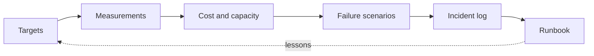
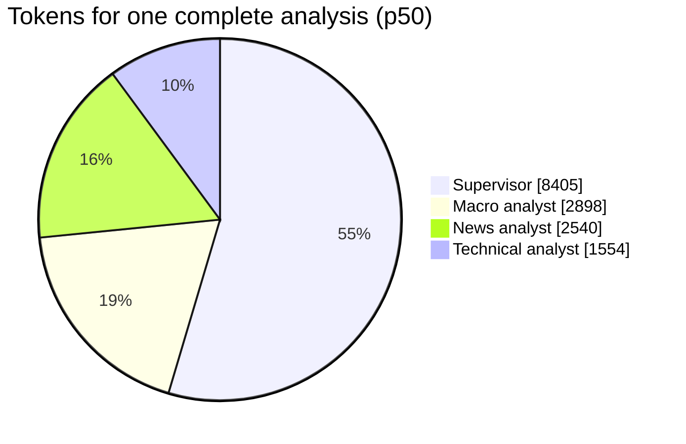
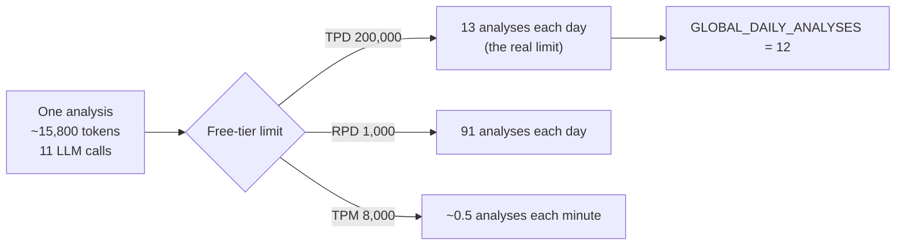
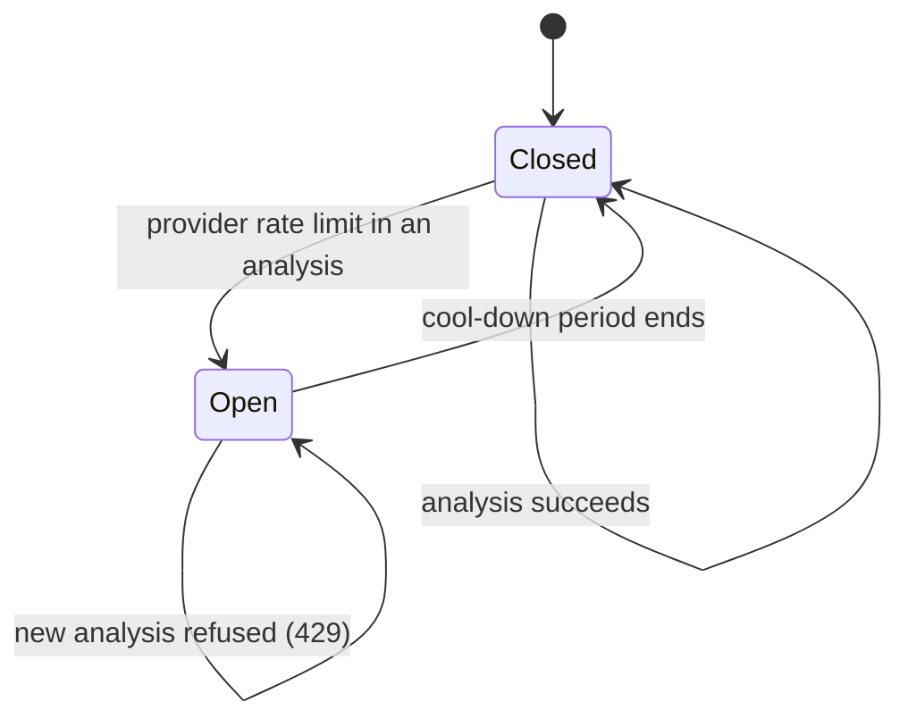
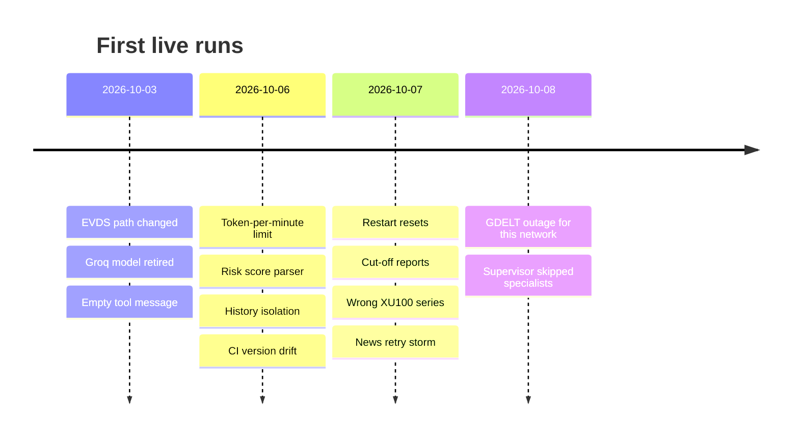
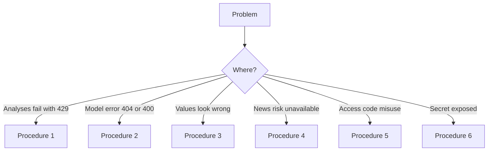

# Operations

> **Note:** This document uses ASD-STE100 Simplified Technical English.

This document tells how Investing Engine operates and how it fails. It gives
the targets, the measured values, the cost, the capacity, the failure
scenarios, the incidents that occurred in live runs, and the procedures for
the operator.

---

## Service targets

The targets apply to one analysis of one to three instruments.

| Target | Value | How it is measured |
|---|---|---|
| Latency | 95% of analyses complete in less than 90 seconds | `scripts/benchmark.py`, `timings.total_seconds` |
| Complete report | 100% of reports have all sections and the disclaimer | Report check, live runs |
| Grounded figures | 100% of precise figures agree with tool data | `checks.grounding_score` on each analysis |
| Data isolation | No result of one user is visible to another user | Unit tests, security review |
| Cost | No cost on the free tier; less than USD 0.01 for each analysis on the paid tier | `scripts/token_profile.py` |
| Safe failure | A failed data source never gives an invented value | Prompts, report check, tests |

---

## Measurements

All values are from short live runs on 2026-10-07 and 2026-10-08 with the
Groq free tier, one XU100 analysis at a time. During these runs, GDELT refused
requests from the test network (incident 12). Thus the news analyst had no
headlines, and the token counts of the news step are lower than with live
news. Repeat the measurements when GDELT is available.

| Measurement | Value | Source |
|---|---|---|
| Latency, one cold analysis | 49.6 s (server 47.3 s) | `scripts/benchmark.py`, 2026-10-07 |
| Latency, complete analyses | 45.3 s and 102.3 s | `scripts/token_profile.py`, 2026-10-08 |
| Tokens for each complete analysis | p50 15,265, p95 15,753 | `scripts/token_profile.py` |
| LLM calls for each complete analysis | 11 | `scripts/token_profile.py` |
| Complete analyses (all three core specialists) | 2 of 3 | Incident 13 |
| Prompt injection, 5 English attacks (gpt-oss-20b) | 0 of 4 completed runs succeeded, without and with guardrails | `scripts/redteam_eval.py`, 2026-10-07 |
| Prompt injection, 6 Turkish and 2 structural attacks (gpt-oss-20b) | Not conclusive (see below) | `scripts/redteam_eval.py`, 2026-10-08 |

**Latency.** The 102.3 s analysis is more than the 90 s target. One analysis
uses approximately 15,000 tokens, and the free tier permits 8,000 tokens each
minute. The probable cause is that the client waited for `Retry-After` after
a token-per-minute limit. On the free tier, the latency target is thus not
guaranteed. On the paid tier, this limit is much higher.

**Supervisor.** The supervisor writes the plan and the final report. It uses
more than half of the tokens. To decrease the cost, decrease the size of the
specialist answers that the supervisor reads, not the specialist prompts.

**Red-team result of 2026-10-08.** No attack succeeded. But the guardrail
flagged only 1 of the 5 completed guarded runs. The scanner flags these
Turkish attacks when it reads the same PDF directly. Thus in most runs the
disclosure analyst probably did not read the document, and the attack did not
reach a model. The script now records `delivered` and calculates the attack
success rate only from runs where the disclosure analyst read the document.
A repeat run stopped at the daily token limit of gpt-oss-20b. Repeat it on a
new day.

### Cost and capacity

Groq prices for `openai/gpt-oss-120b` (paid tier, from the Groq model page on
2026-10-08): USD 0.15 for each million input tokens and USD 0.60 for each
million output tokens. Free-tier limits for each model: 200,000 tokens each
day (TPD), 8,000 tokens each minute (TPM), 1,000 requests each day (RPD) and
30 requests each minute (RPM).

| Item | Value |
|---|---|
| Cost of one analysis on the paid tier | USD 0.0028 (p50), USD 0.0029 (p95) |
| Cost of 1,000 analyses on the paid tier | Approximately USD 2.90 |
| Analyses each day on the free tier | 13 (200,000 TPD / 15,753 tokens) |
| Analyses each day if only requests were the limit | 91 (1,000 RPD / 11 calls) |
| Analyses each minute on the free tier | Approximately 0.5 (TPM) |
| Default `GLOBAL_DAILY_ANALYSES` | 12, so that the free tier is never used up before the cap |

The token limit for each day is the real limit, not the request limit. Two
users who each start six analyses use the full free-tier budget of one day.
For more users, use the paid tier: 1,000 analyses cost approximately
USD 2.90.

---

## Failure scenarios

The table gives each known failure, how the system finds it, and what the
system does.

| Failure | Detection | Behaviour | Test |
|---|---|---|---|
| Model provider rate limit (429) | HTTP 429 from Groq | The client waits for `Retry-After` and tries again (maximum `LLM_MAX_RETRIES`). After a failed analysis, a circuit breaker stops new analyses for a cool-down period. The gateway sends an owner alert. | `test_observability`, `test_access_codes` |
| Model retired or renamed | HTTP 404 `model_not_found` | The analysis fails with a clear error. The operator changes `GROQ_MODEL`. | Incident 2 |
| Model answer cut off | Report without its last sections | Reasoning effort `low` and a 2048-token budget. | Incident 9 |
| EVDS endpoint changed or down | Non-JSON or HTTP error | The tool returns an error. The report says that the data is missing. | `test_evds` |
| Wrong EVDS series | Series name does not contain the symbol | `verify_evds_series.py` fails. | `test_evds` |
| GDELT rate limit or outage | HTTP 429, connection error | The last good headlines (maximum 24 hours old) are used and marked as stale. Else the risk score is "unavailable". | `test_services` |
| Uploaded file expired or service restarted | Upload ID not in the store | HTTP 422 "Upload it again", before any model call. | `test_api` |
| Prompt injection in a document or headline | Pattern scan, optional classifier | The sentence is removed before a model reads it. The report shows the flags. | `test_guardrails`, red-team script |
| Invented or changed figure | Numeric grounding | The report shows the figures that do not agree with tool data. | `test_guardrails` |
| Daily budget used | Usage store | HTTP 429 with `Retry-After`, before any model call. | `test_observability` |
| Access code leaked | Code used on a second device | The second device is refused. The owner gets an alert and can revoke the code. | `test_access_codes` |
| Guessing of access codes | Many invalid codes in one hour | Owner alert. Codes are 128-bit values, so guessing is not practical. | `test_access_codes` |
| Secret in a commit | gitleaks pre-commit hook, CI, GitHub push protection | The commit or the push is refused. | `.gitleaks.toml` |

---

## Incident log

These incidents occurred during the first live runs with the real model and
the real data sources. Each incident has a cause, a fix and a prevention.

| # | Date | Symptom | Cause | Fix | Prevention |
|---|---|---|---|---|---|
| 1 | 2026-10-03 | All EVDS series gave "non-JSON response" | EVDS moved its API to a new path; the old path served HTML | New base URL | `verify_evds_series.py` before each release |
| 2 | 2026-10-03 | HTTP 404 `model_not_found` | Groq removed `llama-3.3-70b-versatile` from the free tier | Default model `openai/gpt-oss-120b` | Model is a setting; incident procedure below |
| 3 | 2026-10-03 | HTTP 400 on the first tool result | A tool that returns an empty list gave a tool message with no content | MCP interceptor writes the payload as text | Regression test |
| 4 | 2026-10-06 | Analyses stopped with HTTP 429 | Free tier limit of 8,000 tokens per minute | Retries with `Retry-After`, configurable count | Capacity plan in this document |
| 5 | 2026-10-06 | No news risk score | Model wrote the score in Markdown; the parser did not accept it | Tolerant parser, plain-text instruction | Parser tests for variants |
| 6 | 2026-10-06 | Private results visible to other users (found in security review) | Shared history table had no owner | History rows owned by a salted hash of the user | Isolation tests |
| 7 | 2026-10-06 | First CI runs on main failed | Unpinned type stubs moved to pandas 3; a removed Trivy tag; old setuptools in the runner | Pinned versions, new tag, upgrade step | Dependabot, branch protection |
| 8 | 2026-10-07 | After a restart, access codes had their full quota again; analyses had no technical data | Code store in tmpfs; upload IDs lost from memory | Named volume; uploads examined before any model call | Tests |
| 9 | 2026-10-07 | Reports stopped in the middle of a sentence | Hidden reasoning tokens used the 1024-token output budget | Reasoning effort `low`, budget 2048 | Live check of report completeness |
| 10 | 2026-10-07 | XU100 showed about 48,600 points instead of about 12,400 | Series code pointed to BIST All Shares-100, not BIST-100 | Correct series | Series-name verification |
| 11 | 2026-10-07 | News analyst called the news tool five times, then gave no answer | GDELT rate limit and no instruction for failures | One call; always a written answer | Prompt rules |
| 12 | 2026-10-08 | News unavailable for more than a day | GDELT refused this network's address (HTTP 429) | Stale-result fallback; tone request optional | Tests; owner alert on provider limits |
| 13 | 2026-10-08 | Reports without news and macro sections; token use changed from 5,600 to 15,800 for the same request | The supervisor model chose to skip required specialists | Prompt: always consult the three core specialists; the result records `missing_specialists` and the interface shows a warning | Test; the warning makes each skip visible |

**Lessons:**

- A data source can give data and still be the wrong data. Examine the
  meaning of the data, not only its format.
- Free tiers change. The model, the limits and the prices are settings, not
  constants in the code.
- Each external call needs a defined behaviour for failure. The report must
  say "not available", never estimate.
- State in memory or in tmpfs is lost on a restart. Decide for each state
  if it must survive a restart.
- A model that plans its own work can skip steps. Check the result for each
  required step and show a skipped step to the user.
- Set limits from measurements. The first default of 50 analyses each day
  was four times the measured free-tier capacity.

---

## Runbook

### Procedure 1: Analyses fail with 429

1. Look at the API log for `RateLimitError` or `X-Limit-Reason: provider`.
2. If the provider limit is the cause, wait one minute. The circuit breaker
   opens again automatically.
3. If it occurs every day, decrease `GLOBAL_DAILY_ANALYSES` or move to a paid
   tier. Refer to [Cost and capacity](#cost-and-capacity).
4. If the user budget is the cause, the limit resets at 00:00 UTC.

### Procedure 2: Model error 404 or 400

1. Read the error message in the API log.
2. For `model_not_found`, find a supported model on the provider's model page.
3. Set `GROQ_MODEL` to the new model. Restart the API.
4. Run one analysis. Make sure that the report is complete.

### Procedure 3: Values look wrong

1. Run `python scripts/verify_evds_series.py`.
2. Compare the latest close with a public source for the same day.
3. If a series is wrong, correct the series code in `universe.py`.
4. Delete the history rows that were made with the wrong data.

### Procedure 4: News risk is unavailable

1. Test GDELT from the server:
   `curl -s -o /dev/null -w "%{http_code}" "https://api.gdeltproject.org/api/v2/doc/doc?query=Aselsan&mode=artlist&format=json"`
2. If the result is 429, wait. Do not send more requests: they extend the limit.
3. The system uses stale headlines (maximum 24 hours old) during the outage.

### Procedure 5: Access code misuse

1. Read the alert e-mail. It gives the first eight characters of the code ID.
2. Revoke the code: `python -m gateway.codes revoke <id>`.
3. For a permanent stop, add the ID to `REVOKED_CODE_IDS`.
4. If many codes are affected, set a new `ACCESS_CODE_SECRET`. All old codes stop.

### Procedure 6: Secret exposed

1. Rotate the key at the provider (Groq, EVDS, Langfuse, SMTP) immediately.
2. Change the secret in the secret store (GitHub, Azure, Hugging Face, `.env`).
3. Restart the services.
4. If the secret is in a commit, the key is compromised also after you remove
   the commit. Step 1 is necessary.
